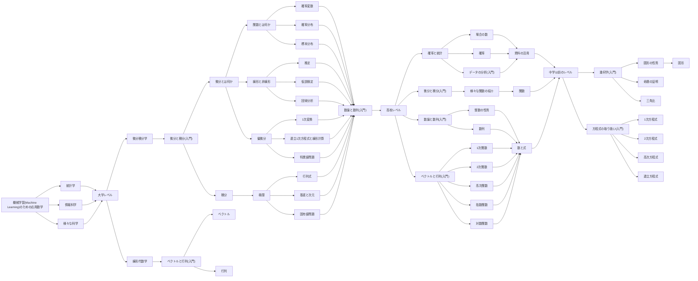

```mermaid
graph LR
    A["機械学習(Machine Learning)のための応用数学"] --> B["統計学"]
    A --> C["情報科学"]
    A --> D["様々な科学"]
    B --> E["大学レベル"]
    C --> E
    D --> E
    E --> F["微分積分学"]
    E --> G["線形代数学"]
    F --> H["微分と積分(入門)"]
    G --> I["ベクトルと行列(入門)"]
    H --> J["微分とは何か"]
    H --> K["積分"]
    I --> L["ベクトル"]
    I --> M["行列"]
    J --> N["関数とは何か"]
    J --> O["線形と非線形"]
    J --> P["偏微分"]
    K --> Q["極限"]
    N --> R["確率変数"]
    N --> S["確率分布"]
    N --> T["標本分布"]
    O --> U["推定"]
    O --> V["仮説検定"]
    O --> W["回帰分析"]
    P --> X["1次変換"]
    P --> Y["連立1次方程式と線形計算"]
    P --> Z["特異値問題"]
    Q --> AA["行列式"]
    Q --> AB["基底と次元"]
    Q --> AC["固有値問題"]
    R --> AD["数論と数列(入門)"]
    S --> AD
    T --> AD
    U --> AD
    V --> AD
    W --> AD
    X --> AD
    Y --> AD
    Z --> AD
    AA --> AD
    AB --> AD
    AC --> AD
    AD --> AE["高校レベル"]
    AE --> AF["確率と統計"]
    AE --> AG["微分と積分(入門)"]
    AE --> AH["数論と数列(入門)"]
    AE --> AI["ベクトルと行列(入門)"]
    AF --> AJ["場合の数"]
    AF --> AK["確率"]
    AF --> AL["データの分析(入門)"]
    AG --> AM["様々な関数の紹介"]
    AH --> AN["整数の性質"]
    AH --> AO["数列"]
    AI --> AP["1次関数"]
    AI --> AQ["2次関数"]
    AI --> AR["高次関数"]
    AI --> AS["指数関数"]
    AI --> AT["対数関数"]
    AJ --> AU["資料の活用"]
    AK --> AU
    AL --> AU
    AM --> AV["関数"]
    AN --> AW["数と式"]
    AO --> AW
    AP --> AW
    AQ --> AW
    AR --> AW
    AS --> AW
    AT --> AW
    AU --> AX["中学以前のレベル"]
    AV --> AX
    AW --> AX
    AX --> AY["幾何学(入門)"]
    AX --> AZ["方程式の取り扱い(入門)"]
    AY --> BA["図形の性質"]
    AY --> BB["命題の証明"]
    AY --> BC["三角比"]
    AZ --> BD["1次方程式"]
    AZ --> BE["2次方程式"]
    AZ --> BF["高次方程式"]
    AZ --> BG["連立方程式"]
    BA --> BH["図形"]
```
