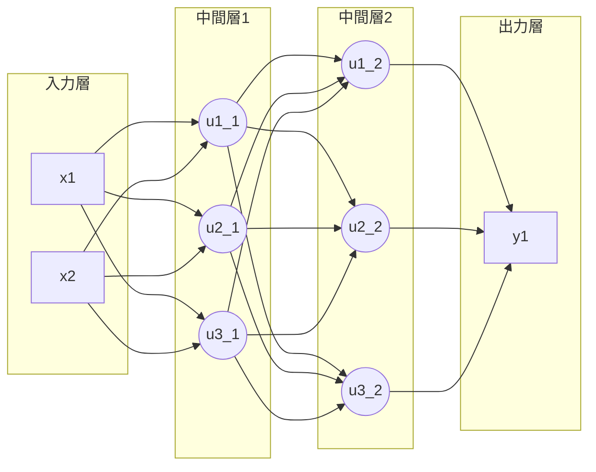
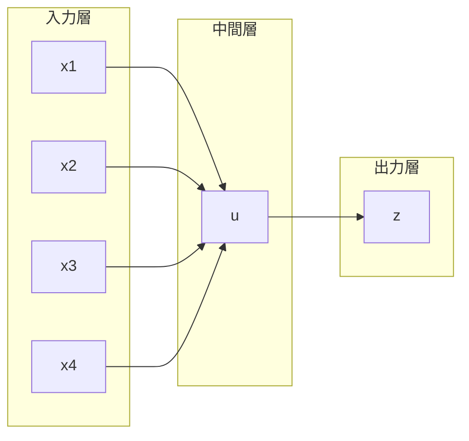
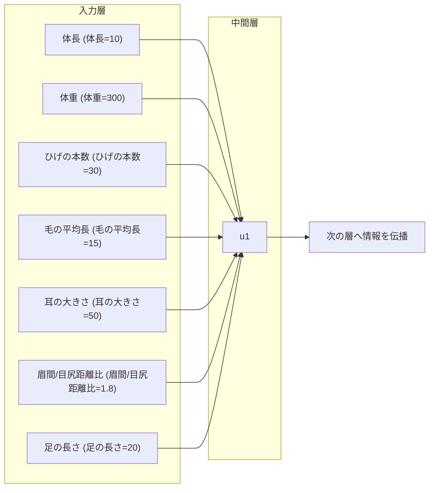
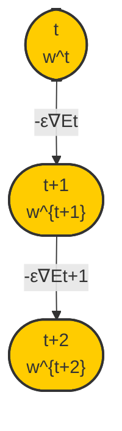
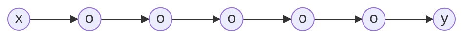

# 深層学習day1

# 目次

* [全体像](#全体像)
* [入力層〜中間層](#入力層中間層)
* [活性化関数](#活性化関数)
* [出力層](#出力層)
* [勾配降下法](#勾配降下法)
* [誤差逆伝播法](#誤差逆伝播法)


# 全体像
# 識別モデルと生成モデル

## 識別と生成の目的
- **識別 (Discriminative)**: データを目的のクラスに分類する  
  - データ → クラス
- **生成 (Generative)**: 特定のクラスのデータを生成する  
  - クラス → データ
### 例
- **識別**: 犬や猫の画像データを分類
- **生成**: 犬らしい画像を生成
## 計算結果
- **識別** 
- 条件「あるデータxが与えられた」もとでクラス$C_k$である確率:
 $$p(C_k | \mathbf{x}$$
- **生成**: 条件「あるクラスyに属する」もとでデータ$C_k$の分布:  
 $$p(\mathbf{x} | C_k)$$
## 具体的なモデル
- **識別モデル**: 決定木、ロジスティック回帰、サポートベクターマシン (SVM)、ニューラルネットワーク
- **生成モデル**: 隠れマルコフモデル、ベイジアンネットワーク、変分オートエンコーダー (VAE)、敵対的生成ネットワーク (GAN)
## 特徴
- **識別モデル**: 高次元 → 低次元、必要な学習データ: 少
- **生成モデル**: 低次元 → 高次元、必要な学習データ: 多
## 応用例
- **識別モデル**: 画像認識
- **生成モデル**: 画像の超解像、テキスト生成
## 識別器の開発アプローチ
### 生成モデル
- 各クラスの生起確率やクラス条件付き密度をモデル化。
- **学習コスト**: 高い
- **確率計算**:  
 $$p(C_k | \mathbf{x}) = \frac{p(\mathbf{x} | C_k) \cdot p(C_k)}{p(\mathbf{x})}$$ 
  ただし、  
 $$p(\mathbf{x}) = \sum_{k} p(\mathbf{x} | C_k) \cdot p(C_k)$$

### 識別モデル
- データがクラスに属する確率を推定。
- **学習コスト**: 中程度

### 識別関数
- データを直接クラスに写像する関数fxを推定。
- **学習コスト**: 低い
## ニューラルネットワーク（NN）でできること

### 分類

* 猫写真の判別
* 手書き文字認識
* 花の種類分類

**ニューラルネットワーク：分類**

性別（男あるいは女）や動物の種類など離散的な結果を予想するための分析

【分類分析】
* ベイズ分類
* ロジスティック回帰
* 決定木
* ランダムフォレスト
* ニューラルネットワーク（NN）

### 回帰

* 結果予想
    * 売上予想
    * 株価予想
* ランキング
    * 競馬順位予想
    * 人気順位予想

**ニューラルネットワーク：回帰**

連続する実数値を取る関数の近似

【回帰分析】
* 線形回帰
* 回帰木
* ランダムフォレスト
* ニューラルネットワーク（NN）

### 深層学習の実用例

* 自動売買（トレード）
* チャットボット
* 翻訳
* 音声解釈
* 囲碁、将棋 AI


## 万能近似定理と深さ

## 万能近似定理 (Universal Approximation Theorem)
- 単層のニューラルネットワークが十分な数のユニット（ニューロン）を持つ場合、任意の連続関数を近似できることを示す定理。
- 主な出典: Hornik et al., 1989 / Cybenko, 1989
- 参考リンク: [Universal Approximation Properties and Depth](http://www.deeplearningbook.org/contents/mlp.html)

## 出典
1. Christopher M. Bishop, _Pattern Recognition and Machine Learning_, 2006  
   [PDF Link](https://www.microsoft.com/en-us/research/uploads/prod/2006/01/Bishop-Pattern-Recognition-and-Machine-Learning-2006.pdf)
2. 外部優良資料: [PRMLの学習 普及版](https://herumi.github.io/prml/)
3. Universal Approximation Properties:  
   [Deep Learning Book](http://www.deeplearningbook.org/contents/mlp.html)
4. Carnegie Mellon University Deep Learning Lecture:  
   [YouTube Video](https://www.youtube.com/watch?v=lkha188L4Gs)

## 確認テスト1
- ディープラーニングは、結局何をやろうとしているか2行以内で述べよ。
また、次の中のどの値の最適化が最終目的か。

- ディープラーニングはなにをしようとしているか?
明示的なプログラムの代わりに多数の中間層を持つニューラルネットワークを用いて、入力値から目的とする出力値に変換するを数学モデルを構築すること。

- 最適化の最終目的
• ③重み[W]
• ④バイアス[b]

## 確認テスト2
- Q以下の図示
入力層：2ノード1層
中間層：３ノード2層
出力層：1ノード1層



# 入力層中間層
([目次に戻る](#目次))



入力ベクトル: 
$$\mathbf{x} = \begin{pmatrix} x_1 \ x_2 \ x_3 \ x_4 \end{pmatrix}$$
重みベクトル: 
$$\mathbf{w} = \begin{pmatrix} w_1 \ w_2 \ w_3 \ w_4 \end{pmatrix}$$
バイアス: 
$$b$$
総入力 (u):
$$u = w_1 x_1 + w_2 x_2 + w_3 x_3 + w_4 x_4 + b$$
ベクトルと行列の積で表現 →重みwを行ベクトル
$$u = \begin{pmatrix} w_1 & w_2 & w_3 & w_4 \end{pmatrix} \begin{pmatrix} x_1 \ x_2 \ x_3 \ x_4 \end{pmatrix} + b = \mathbf{w}^T \mathbf{x} + b$$

または、重みを列ベクトルとして入力を行ベクトルとすると:
$$u = \begin{pmatrix} x_1 & x_2 & x_3 & x_4 \end{pmatrix} \begin{pmatrix} w_1 \ w_2 \ w_3 \ w_4 \end{pmatrix} + b = \mathbf{x}^T \mathbf{w} + b$$

出力 (z):
$$z = f(u)$$
f は活性化関数!

## 確認テスト1

## 確認テスト2

$$u = \begin{pmatrix} x_1 & x_2 & x_3 & x_4 \end{pmatrix} \begin{pmatrix} w_1 \ w_2 \ w_3 \ w_4 \end{pmatrix} + b = \mathbf{x}^T \mathbf{w} + b$$
$$⇓$$
$$u1 = np.dot(x, W1) + b1$$

## 確認テスト3
中間層の出力しているところの抜き出し
```
# 1層の総出力
z1 = functions.relu(u1)

# 2層の総入力
u2 = np.dot(z1, W2) + b2
```

## 順伝播（3層・複数ユニット）の考察

```
def init_network():
    print("##### ネットワークの初期化 #####")
    network = {}

    input_layer_size = 3
    hidden_layer_size_1=10
    hidden_layer_size_2=5
    output_layer_size = 4

    #試してみよう
    #_各パラメータのshapeを表示
    #_ネットワークの初期値ランダム生成
    network['W1'] = np.random.rand(input_layer_size, hidden_layer_size_1)
    network['W2'] = np.random.rand(hidden_layer_size_1,hidden_layer_size_2)
    network['W3'] = np.random.rand(hidden_layer_size_2,output_layer_size)

    network['b1'] =  np.random.rand(hidden_layer_size_1)
    network['b2'] =  np.random.rand(hidden_layer_size_2)
    network['b3'] =  np.random.rand(output_layer_size)

    print_vec("重み1", network['W1'] )
    print_vec("重み2", network['W2'] )
    print_vec("重み3", network['W3'] )
    print_vec("バイアス1", network['b1'] )
    print_vec("バイアス2", network['b2'] )
    print_vec("バイアス3", network['b3'] )

    return network

# プロセスを作成
# x：入力値
def forward(network, x):

    print("##### 順伝播開始 #####")

    W1, W2, W3 = network['W1'], network['W2'], network['W3']
    b1, b2, b3 = network['b1'], network['b2'], network['b3']

    # 1層の総入力
    u1 = np.dot(x, W1) + b1

    # 1層の総出力
    z1 = functions.relu(u1)

    # 2層の総入力
    u2 = np.dot(z1, W2) + b2

    # 2層の総出力
    z2 = functions.relu(u2)

    # 出力層の総入力
    u3 = np.dot(z2, W3) + b3

    # 出力層の総出力
    y = u3

    print_vec("総入力1", u1)
    print_vec("中間層出力1", z1)
    print_vec("中間層出力2", z2)
    print_vec("総入力2", u2)
    print_vec("出力", y)
    print("出力合計: " + str(np.sum(y)))

    return y, z1, z2

# 入力値
x = np.array([1., 2., 4.])
print_vec("入力", x)

# ネットワークの初期化
network =  init_network()

y, z1, z2 = forward(network, x)
```

1.  **`init_network()`**:
    * ネットワークの各層の重み (`W1`, `W2`, `W3`) 
    * バイアス (`b1`, `b2`, `b3`)
    * パラメータ
        * `W1`: (入力層のユニット数, 中間層1のユニット数) = (3, 10)
        * `W2`: (中間層1のユニット数, 中間層2のユニット数) = (10, 5)
        * `W3`: (中間層2のユニット数, 出力層のユニット数) = (5, 4)
        * `b1`: (中間層1のユニット数) = (10)
        * `b2`: (中間層2のユニット数) = (5)
        * `b3`: (出力層のユニット数) = (4)

2.  **`forward(network, x)`**:
* 引数
    * 初期化されたネットワーク (`network`) 
    * 入力値 (`x`)
* 処理概要
    * 算出：総入力 (`u1`, `u2`, `u3`) 活性化後の出力 (`z1`, `z2`, `y`)
    * **1層 (入力層 -> 中間層1):**
        * 総入力: 
         $$\mathbf{u}^{(1)} = \mathbf{x} \mathbf{W}^{(1)} + \mathbf{b}^{(1)} $$
        * 活性化関数:
          $$\mathbf{z}^{(1)} = \text{ReLU}(\mathbf{u}^{(1)}) $$
    * **2層 (中間層1 -> 中間層2):**
        * 総入力
         $$\mathbf{u}^{(2)} = \mathbf{z}^{(1)} \mathbf{W}^{(2)} + \mathbf{b}^{(2)} $$
        * 活性化関数
          $$\mathbf{z}^{(2)} = \text{ReLU}(\mathbf{u}^{(2)}) $$
    * **出力層 (中間層2 -> 出力層):**
        * 総入力
          $$ \mathbf{u}^{(3)} = \mathbf{z}^{(2)} \mathbf{W}^{(3)} + \mathbf{b}^{(3)} $$
        * 活性化関数
          $$ \mathbf{y} = \mathbf{u}^{(3)} $$

  **入力値 `x`**:
    * `np.array([1., 2., 4.])` 

```mermaid
graph LR
  subgraph 入力層["入力層 (Input Layer)"]
    x1["x[1]"]
    x2["x[2]"]
    x3["x[3]"]
  end

  subgraph 中間層1["中間層1 (Hidden Layer 1)"]
    h1_1["h1[1]"]
    h1_2["h1[2]"]
    h1_3["h1[3]"]
    h1_4["h1[4]"]
    h1_5["h1[5]"]
    h1_6["h1[6]"]
    h1_7["h1[7]"]
    h1_8["h1[8]"]
    h1_9["h1[9]"]
    h1_10["h1[10]"]
  end

  subgraph 中間層2["中間層2 (Hidden Layer 2)"]
    h2_1["h2[1]"]
    h2_2["h2[2]"]
    h2_3["h2[3]"]
    h2_4["h2[4]"]
    h2_5["h2[5]"]
  end

  subgraph 出力層["出力層 (Output Layer)"]
    y1["y[1]"]
    y2["y[2]"]
    y3["y[3]"]
    y4["y[4]"]
  end

  x1 -->|W1| h1_1
  x1 -->|W1| h1_2
  x1 -->|W1| h1_3
  x1 -->|W1| h1_4
  x1 -->|W1| h1_5
  x1 -->|W1| h1_6
  x1 -->|W1| h1_7
  x1 -->|W1| h1_8
  x1 -->|W1| h1_9
  x1 -->|W1| h1_10

  x2 -->|W1| h1_1
  x2 -->|W1| h1_2
  x2 -->|W1| h1_3
  x2 -->|W1| h1_4
  x2 -->|W1| h1_5
  x2 -->|W1| h1_6
  x2 -->|W1| h1_7
  x2 -->|W1| h1_8
  x2 -->|W1| h1_9
  x2 -->|W1| h1_10

  x3 -->|W1| h1_1
  x3 -->|W1| h1_2
  x3 -->|W1| h1_3
  x3 -->|W1| h1_4
  x3 -->|W1| h1_5
  x3 -->|W1| h1_6
  x3 -->|W1| h1_7
  x3 -->|W1| h1_8
  x3 -->|W1| h1_9
  x3 -->|W1| h1_10

  h1_1 -->|W2| h2_1
  h1_1 -->|W2| h2_2
  h1_1 -->|W2| h2_3
  h1_1 -->|W2| h2_4
  h1_1 -->|W2| h2_5

  h1_2 -->|W2| h2_1
  h1_2 -->|W2| h2_2
  h1_2 -->|W2| h2_3
  h1_2 -->|W2| h2_4
  h1_2 -->|W2| h2_5

  h1_3 -->|W2| h2_1
  h1_3 -->|W2| h2_2
  h1_3 -->|W2| h2_3
  h1_3 -->|W2| h2_4
  h1_3 -->|W2| h2_5

  h1_4 -->|W2| h2_1
  h1_4 -->|W2| h2_2
  h1_4 -->|W2| h2_3
  h1_4 -->|W2| h2_4
  h1_4 -->|W2| h2_5

  h1_5 -->|W2| h2_1
  h1_5 -->|W2| h2_2
  h1_5 -->|W2| h2_3
  h1_5 -->|W2| h2_4
  h1_5 -->|W2| h2_5

  h1_6 -->|W2| h2_1
  h1_6 -->|W2| h2_2
  h1_6 -->|W2| h2_3
  h1_6 -->|W2| h2_4
  h1_6 -->|W2| h2_5

  h1_7 -->|W2| h2_1
  h1_7 -->|W2| h2_2
  h1_7 -->|W2| h2_3
  h1_7 -->|W2| h2_4
  h1_7 -->|W2| h2_5

  h1_8 -->|W2| h2_1
  h1_8 -->|W2| h2_2
  h1_8 -->|W2| h2_3
  h1_8 -->|W2| h2_4
  h1_8 -->|W2| h2_5

  h1_9 -->|W2| h2_1
  h1_9 -->|W2| h2_2
  h1_9 -->|W2| h2_3
  h1_9 -->|W2| h2_4
  h1_9 -->|W2| h2_5

  h1_10 -->|W2| h2_1
  h1_10 -->|W2| h2_2
  h1_10 -->|W2| h2_3
  h1_10 -->|W2| h2_4
  h1_10 -->|W2| h2_5

  h2_1 -->|W3| y1
  h2_1 -->|W3| y2
  h2_1 -->|W3| y3
  h2_1 -->|W3| y4

  h2_2 -->|W3| y1
  h2_2 -->|W3| y2
  h2_2 -->|W3| y3
  h2_2 -->|W3| y4

  h2_3 -->|W3| y1
  h2_3 -->|W3| y2
  h2_3 -->|W3| y3
  h2_3 -->|W3| y4

  h2_4 -->|W3| y1
  h2_4 -->|W3| y2
  h2_4 -->|W3| y3
  h2_4 -->|W3| y4

  h2_5 -->|W3| y1
  h2_5 -->|W3| y2
  h2_5 -->|W3| y3
  h2_5 -->|W3| y4
```



# 活性化関数
## 確認テスト5
線形・非線形関数の図示

```
import matplotlib.pyplot as plt
import numpy as np

# 線形関数
def linear_function(x, slope, intercept):
    return slope * x + intercept

# 非線形関数 (sin)
def sine_function(x):
    return np.sin(x)
```

線形:2x+1
非線形：sin(x)
### 線形な関数
以下満たす
• 加法性: 𝑓 𝑥 + 𝑦 = 𝑓 𝑥 + 𝑓(𝑦)
• 斉次性: 𝑓 𝑘𝑥 = 𝑘𝑓 𝑥

### 非線形な関数
加法性･斉次性を満たさない


## 活性化関数
### ステップ関数

```
def step_function(x):
  if x > 0:
    return 1
  else:
    return 0
```

数式:
$$
f(x) = \begin{cases}
1 & (x \ge 0) \
0 & (x < 0)
\end{cases}
$$

説明:
しきい値を超えたら発火する関数であり、出力は常に1か0。
パーセプトロン（ニューラルネットワークの前身）で利用

課題:
0-1の間の状態を表現できず、線形分離可能なものしか学習できなかった。

### シグモイド関数
```
def sigmoid(x):
  return 1 / (1 + np.exp(-x))
```
数式:
$$
f(u) = \frac{1}{1 + e^{-x}}
$$

説明:
0 ~ 1 の間を緩やかに変化する関数で、ステップ関数ではON/OFFしかない状態に対し、信号の強弱を伝えられるようになり、初期ニューラルネットワーク普及のきっかけとなった。

課題:
大きな値では出力の変化が微小なため、勾配消失問題を引き起こす事があった。

## ReLU関数

```
def relu(x):
  return np.maximum(0, x)
```
$$
f(x) = \begin{cases}
x & (x > 0) \
0 & (x \le 0)
\end{cases}
$$

説明:
今最も使われている( 勾配消失問題の回避とスパース化に貢献)
※勾配消失問題

※スパース化


## 全結合NN（単層・複数層）

**パラメータ:**
* 入力: $x_i$
* 重み: $w_{ji}$
* バイアス:$b_j$
* 総入力: $u_j$
* 出力: $z_j$
* 活性化関数: $f$
* 入力層のインデックス: $i$
* 第1層（中間層）のインデックス: $j$

**式:**
$$
\mathbf{u} = \begin{pmatrix} u_1 \\ \vdots \\ u_j \end{pmatrix}, \quad
\mathbf{x} = \begin{pmatrix} x_1 \\ \vdots \\ x_i \end{pmatrix}, \quad
\mathbf{b} = \begin{pmatrix} b_1 \\ \vdots \\ b_j \end{pmatrix}, \quad
\mathbf{z} = \begin{pmatrix} z_1 \\ \vdots \\ z_j \end{pmatrix}
$$

$$
\mathbf{W} = \begin{pmatrix}
  w_{11} & w_{12} & \cdots & w_{1i} \\
  w_{21} & w_{22} & \cdots & w_{2i} \\
  \vdots & \vdots & \ddots & \vdots \\
  w_{j1} & w_{j2} & \cdots & w_{ji}
\end{pmatrix}, \quad
f(\mathbf{u}) = \begin{pmatrix} f(u_1) \\ f(u_2) \\ \vdots \\ f(u_j) \end{pmatrix}
$$

### 総入力の計算
$$
\mathbf{u} = \mathbf{W} \mathbf{x} + \mathbf{b}
$$

### 出力の計算
$$
\mathbf{z} = f(\mathbf{u})
$$

* $\mathbf{x}$ は入力層の出力ベクトル
* $\mathbf{W}$ は入力層から中間層への重み行列
* $\mathbf{b}$ は中間層へのバイアスベクトル
* $\mathbf{u}$ は中間層への総入力ベクトル
* f は活性化関数
* $\mathbf{z}$ は中間層の出力ベクトル

## 確認テスト
数式実装箇所の抜き出し
$$
\mathbf{z} = f(\mathbf{u})
$$
$$⇓$$

```python
z = functions.sigmoid(u)
```


```python
#上記の定義：sigmoid関数 
def sigmoid(x):
    return 1/(1 + np.exp(-x))
```

# 出力層

* **出力層:** 2つのユニット ($y_1^{(n)}$、$y_2^{(n)}$)。活性化関数 $f^{(2)}$ を適用。総入力は $u_k^{(2)}$。
* **教師信号:** 2つのユニット ($d_1^{(n)}$、$d_2^{(n)}$)。

* 誤差関数
$$E_n(w)$$
$$⇓$$
$$\nabla E_n(w) = \frac{\partial E_n}{\partial w}$$
$$⇓$$
$$
w^{(t+1)} = w^{(t)} - \epsilon \nabla E_n(w)
$$

## 確認テスト
・なぜ、引き算でなく二乗するか述べよ
・下式の1/2はどういう意味を持つか述べよ
$$E_t(\mathbf{w}) = \frac{1}{2} \sum_{i=1}^{n} (y_i - d_i)^2 = \frac{1}{2} \|\mathbf{y} - \mathbf{d}\|^2$$

• 2乗する理由
引き算を行うだけでは、各ラベルでの誤差で正負両方の値が発生し、全体の誤差を正しくあらわ
すのに都合が悪い。2乗してそれぞれのラベルでの誤差を正の値になるようにする。

• 1/2する理由
実際にネットワークを学習するときに行う誤差逆伝搬の計算で、誤差関数の微分を用いるが、その際の計算式を簡単にするため。本質的な意味はない。
(微分をしたときに2乗と総裁するため)

## 全結合NN - 出力層の種類

|            | 回帰                | 二値分類                              | 多クラス分類                                                   |
| ---------- | ------------------- | ------------------------------------- | -------------------------------------------------------------- |
| 活性化関数 | 恒等写像 $$f(u)=u$$ | シグモイド$$f(u)=\frac{1}{1+e^{-u}}$$ | ソフトマックス$$f(u_i)=\frac{e^{u_i}}{\sum_{k=1}^{K}e^{u_k}}$$ |
| 誤差関数   | 二乗誤差            | 交差エントロピ                        | 交差エントロピ                                                 |


**二乗誤差:**
$$
E_n(\mathbf{w}) = \frac{1}{2} \sum_{i=1}^{I} (y_n - d_n)^2
$$
* $y_n$ ネットワークの出力
* $d_n$ 教師データ

**交差エントロピー:**
$$
E_n(\mathbf{w}) = -\sum_{i=1}^{I} d_i \log y_i
$$
ここで、
* $$ y_i $$ はネットワークの出力（確率）
* $$ d_i $$ は教師データ（one-hotベクトルなど）

$$
E(\mathbf{w})=\sum_{n=1}^{N} E_n
$$
* $N$ は訓練データのサンプル数
* $E_n$ は各訓練データサンプルにおける誤差

## 確認テスト

以下の数式に対応するソースコードを示し、一行ずつ処理の説明をせよ。（5分）

**(1) 二乗誤差**
$$
E_n(\mathbf{w}) = \frac{1}{2} \sum_{i=1}^{I} (y_i - d_i)^2
$$

**(2) 交差エントロピー**
$$
E_n(\mathbf{w}) = - \sum_{i=1}^{I} d_i \log y_i
$$

### 交差エントロピー誤差関数のソースコードと説明

```python
def cross_entropy_error(d, y):
    if y.ndim == 1:
        d = d.reshape(1, d.size)
        y = y.reshape(1, y.size)

    # 教師データがone-hot-vectorの場合、正解ラベルのインデックスに変換
    if d.size == y.size:
        d = d.argmax(axis=1)
        batch_size = y.shape[0]
        return -np.sum(np.log(y[np.arange(batch_size), d] + 1e-7)) / batch_size

    batch_size = y.shape[0]
    return -np.sum(np.log(y[np.arange(batch_size), d] + 1e-7)) / batch_size
```

## 出力層の中間層との違い
【値の強弱】
• 中間層： しきい値の前後で信号の強弱を調整
• 出力層： 信号の大きさ（比率）はそのままに変換
【確率出力】
• 分類問題の場合、出力層の出力は 0 ~ 1 の範囲に限定し、総和を１とす
る必要がある
⇛ 出力層と中間層で利用される活性化関数が異なる
# 勾配降下法

## 勾配降下法のパラメータ更新と誤差逆伝播

* パラメータの更新則
$$
w^{(t+1)} = w^{(t)} - \epsilon \nabla E_n
$$


  ※勾配ベクトル:
$$
\nabla E = \frac{\partial E}{\partial w} = \begin{bmatrix}
    \frac{\partial E}{\partial w_1} & \cdots & \frac{\partial E}{\partial w_n}
\end{bmatrix}^T
$$

* 学習率$\epsilon$

  - 注意1: 学習率が大きすぎた場合、最小値にいつまでもたどり着かない（発散)
  - 学習率が小さい場合発散することはないが、小さすぎると収束するまでに
時間がかかる
    → **学習率$\epsilon$を適切に設定するのが重要! (少しずつ勾配0に近づくようにする)**

* 一回の学習をepocという

## 確認テスト
勾配降下法の実装箇所

```python
network[key] -= learning_rate * grad[key]
```


勾配降下法の学習率の決定、収束性向上のためのアルゴリズム
• Momentum
• AdaGrad
• Adadelta
• Adam

## 確率的勾配降下法（SGD）

### 【確率的勾配降下法】
パラメータの更新則:
$$
w^{(t+1)} = w^{(t)} - \epsilon \nabla E_n
$$
ここで、$$\nabla E_n$$ はランダムに抽出した1つの訓練データサンプルに対する誤差の勾配

### 【勾配降下法】
パラメータの更新則:
$$
w^{(t+1)} = w^{(t)} - \epsilon \nabla E
$$
ここで、$$\nabla E$$ は全ての訓練データサンプルの平均誤差の勾配です。

|                | 確率的勾配降下法（SGD）          | 勾配降下法           |
| -------------- | -------------------------------- | -------------------- |
| **誤差の計算** | ランダムに抽出したサンプルの誤差 | 全サンプルの平均誤差 |

### 確率的勾配降下法のメリット

* データが冗長な場合の計算コストの軽減
* 望まない局所的極小解に収束するリスクの軽減
* オンライン学習(都度都度データ準備するなど) ができる(逆はバッチ学習：最初に全データ用意)


## 確認テスト
- オンライン学習とは？
- 学習データが入ってくるたびに都度パラメータを更新し、学習を進めていく方法。
※バッチ学習では一度にすべての学習データを使ってパラメータ更新を行う。


## ミニバッチ勾配降下法
- パラメータの更新則:
$$
w^{(t+1)} = w^{(t)} - \epsilon \nabla E_t
$$
ここで、$$E_t$$ はミニバッチ $$D_t$$ に属するサンプルの平均誤差であり、
$$
E_t = \frac{1}{N_t} \sum_{n \in D_t} E_n
$$
$$
N_t = |D_t|
$$

- ミニバッチ
  → ランダムに分割したデータの集合
### 【確率的勾配降下法】
パラメータの更新則:
$$
w^{(t+1)} = w^{(t)} - \epsilon \nabla E_n
$$
ここで、$$\nabla E_n$$ はランダムに抽出した1つの訓練データサンプルに対する誤差の勾配です。

|                | ミニバッチ勾配降下法                         | 確率的勾配降下法                 |
| -------------- | -------------------------------------------- | -------------------------------- |
| **誤差の計算** | ミニバッチ$$D_t$$ に属するサンプルの平均誤差 | ランダムに抽出したサンプルの誤差 |


## ミニバッチ降下法のメリット
確率的勾配降下法のメリットを損なわず、計算機のリソースを有効利用できる
→ CPUを利用したスレッド並列化やGPUを利用したSIMD並列化

## 参考図書による補足 
- 意味を分かりやすく解説 - IT用語辞典 e-Words
※SIMD （Single Instruction/Multiple Data）とは
- コンピュータが 並列処理 を行う方式の一つで、一つの命令を同時に複数のデータに適用する方式。 そのような処理方式をベクトル演算、ベクトル処理などと呼ぶことがある。 SIMDでは実行される命令の流れは単一だが、そこに与えられるデータの流れは複数あり、同じ処理を複数のデータに同時に実行することができる。

## 確認テスト
誤差勾配降下法の数式の図示



## 誤差勾配の計算 - 数値微分

$$
\nabla E = \frac{\partial E}{\partial w} = \left[ \frac{\partial E}{\partial w_1} \, \ldots \, \frac{\partial E}{\partial w_M} \right]
$$

### 値微分
プログラムで微小な数値を生成し擬似的に微分を計算する一般的な手法

$$
\frac{\partial E}{\partial w_m} \approx \frac{E(w_m + h) - E(w_m - h)}{2h}
$$

それぞれのwについて計算する、、

## 数値微分のデメリット

- 各パラメータ \( w_m \) それぞれについて \( E(w_m+h) \) や \( E(w_m-h) \) を計算するために、順伝播の計算を繰り返し行う必要があり負荷が大きい

# 誤差逆伝播法

```python
    # 出力層でのデルタ
    delta2 = functions.d_mean_squared_error(d, y)
    # b2の勾配
    grad['b2'] = np.sum(delta2, axis=0)
    # W2の勾配
    grad['W2'] = np.dot(z1.T, delta2)

    delta1 = np.dot(delta2, W2.T) * functions.d_sigmoid(z1)

    delta1 = delta1[np.newaxis, :]
    # b1の勾配
    grad['b1'] = np.sum(delta1, axis=0)
    x = x[np.newaxis, :]
    # W1の勾配
    grad['W1'] = np.dot(x.T, delta1
```
    
## 計算方法

$$
E(y) = \frac{1}{2} \sum_{j=1}^J (y_j - d_j)^2 = \frac{1}{2} \| y - d \|^2
$$

- \( y \)：ニューラルネットの出力
- \( d \)：教師データ

出力層の出力 \( y \) は、総入力 \( u^{(L)} \) と等しい（恒等写像）。

$$
y = u^{(L)}
$$

総入力 $u^{(l)}$ 

$$
u^{(l)} = w^{(l)} z^{(l-1)} + b^{(l)}
$$

- $w^{(l)}$ 重み行列
- $z^{(l-1)}$ 前の層の出力
- $b^{(l)}$ バイアス項

誤差を重みで微分するため、連鎖律（Chain Rule）を適用

$$
\frac{\partial E}{\partial w_{ji}^{(2)}} = \frac{\partial E}{\partial y} \frac{\partial y}{\partial u} \frac{\partial u}{\partial w_{ji}^{(2)}}
$$

- 誤差の微分：

$$
\frac{\partial E}{\partial y} = y - d
$$

- 出力の総入力に対する微分（恒等関数）：

$$
\frac{\partial y}{\partial u} = 1
$$

- 総入力の重みに対する微分：

$$
\frac{\partial u}{\partial w_{ji}} = z_i
$$

$$
\frac{\partial E}{\partial w_{ji}} = (y_j - d_j) \times z_i
$$

- 出力の誤差 $(y_j - d_j)$
- 前の層の出力 $z_i$

---

## 確認テスト
| 数式                                                                                                   | 対応するPythonコード例                                   |
| :----------------------------------------------------------------------------------------------------- | :------------------------------------------------------- |
| $\frac{\partial E}{\partial y}$                                                                        | `delta2 = functions.d_mean_squared_error(d, y)`          |
| $\frac{\partial E}{\partial y} \frac{\partial y}{\partial u}$                                          | `delta1 = np.dot(delta2, W2.T) * functions.d_sigmoid(z1` |
| $\frac{\partial E}{\partial y} \frac{\partial y}{\partial u} \frac{\partial u}{\partial w^{(2)}_{ji}}$ | `grad['W1'] = np.dot(x.T, delta1`                        |

確率的勾配降下法の実装キャプチャ

