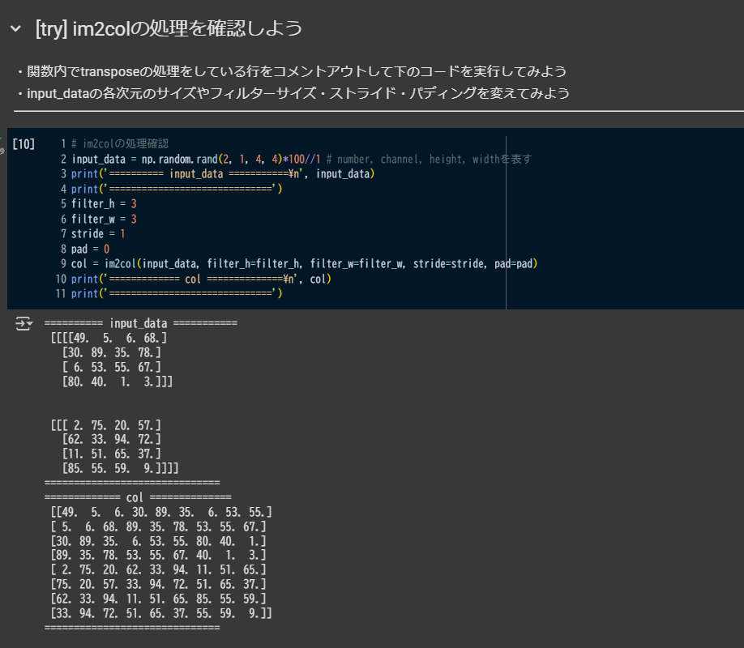

# 目次
- [目次](#目次)
  - [Section1：勾配消失問題](#section1勾配消失問題)
      - [確認テスト](#確認テスト)
    - [誤差逆伝播法の復習](#誤差逆伝播法の復習)
    - [重みの初期化](#重みの初期化)
      - [活性化関数：シグモイド関数](#活性化関数シグモイド関数)
      - [確認テスト](#確認テスト-1)
      - [活性化関数：ReLU関数](#活性化関数relu関数)
    - [重みの初期値設定](#重みの初期値設定)
      - [Xavier](#xavier)
      - [He](#he)
      - [確認テスト](#確認テスト-2)
    - [バッチ正規化](#バッチ正規化)
      - [バッチ正規化の数学的記述](#バッチ正規化の数学的記述)
      - [確認テスト](#確認テスト-3)
      - [例題チャレンジ](#例題チャレンジ)
  - [Section2：学習率最適化手法](#section2学習率最適化手法)
    - [モメンタム](#モメンタム)
      - [勾配降下法](#勾配降下法)
      - [モメンタムのメリット](#モメンタムのメリット)
    - [AdaGrad](#adagrad)
      - [勾配降下法](#勾配降下法-1)
      - [AdaGradのメリット](#adagradのメリット)
    - [RMSProp](#rmsprop)
      - [RMSPropのメリット](#rmspropのメリット)
      - [確認テスト](#確認テスト-4)
    - [実装演習: 勾配消失問題](#実装演習-勾配消失問題)
      - [シグモイド関数とガウス分布](#シグモイド関数とガウス分布)
      - [ReLUのガウス分布](#reluのガウス分布)
      - [Xavier初期化（シグモイド）](#xavier初期化シグモイド)
      - [He初期化](#he初期化)
      - [ReLUとXavier](#reluとxavier)
      - [シグモイドとHe](#シグモイドとhe)
    - [実装演習：学習率正則化](#実装演習学習率正則化)
      - [SGD](#sgd)
      - [モメンタム](#モメンタム-1)
      - [AdaGrad](#adagrad-1)
      - [RMSProp](#rmsprop-1)
      - [Adam](#adam)
      - [SGD（バッチ正則化あり）](#sgdバッチ正則化あり)
  - [Section3：過学習](#section3過学習)
    - [正則化](#正則化)
    - [Weight decay（荷重減衰）](#weight-decay荷重減衰)
      - [過学習の原因](#過学習の原因)
      - [過学習の解決策](#過学習の解決策)
    - [L1、L2正則化](#l1l2正則化)
      - [数式とコード（L1正則化）](#数式とコードl1正則化)
    - [確認テスト](#確認テスト-5)
    - [例題チャレンジ](#例題チャレンジ-1)
      - [L2パラメータ正則化](#l2パラメータ正則化)
    - [例題チャレンジ](#例題チャレンジ-2)
      - [L1パラメータ正則化](#l1パラメータ正則化)
    - [例題チャレンジ(CNN)](#例題チャレンジcnn)
      - [データ拡張](#データ拡張)
    - [ドロップアウト](#ドロップアウト)
      - [過学習の課題](#過学習の課題)
      - [ドロップアウトとは？](#ドロップアウトとは)
      - [メリットとして](#メリットとして)
    - [陰的正則化](#陰的正則化)
    - [陽的正則化と陰的正則化](#陽的正則化と陰的正則化)
      - [エポック数の正則化](#エポック数の正則化)
    - [まとめ](#まとめ)
      - [L1、L2正則化](#l1l2正則化-1)
      - [バッチサイズの効果](#バッチサイズの効果)
        - [バッチサイズによる影響](#バッチサイズによる影響)
        - [バッチサイズの大きさによる影響（模式図）](#バッチサイズの大きさによる影響模式図)
        - [バッチサイズの決め方](#バッチサイズの決め方)
      - [学習率の効果](#学習率の効果)
        - [ハイパーパラメータ（重み）の最適化の模式図](#ハイパーパラメータ重みの最適化の模式図)
        - [学習率による影響](#学習率による影響)
        - [学習率の決め方](#学習率の決め方)
    - [アンサンブル学習](#アンサンブル学習)
      - [予測精度が向上する](#予測精度が向上する)
      - [アンサンブル学習の種類](#アンサンブル学習の種類)
  - [Section4：畳み込みニューラルネットワークの概念](#section4畳み込みニューラルネットワークの概念)
    - [LeNetの構造図](#lenetの構造図)
    - [CNNの構造図（例）](#cnnの構造図例)
    - [バイアス](#バイアス)
    - [パディング](#パディング)
    - [ストライド](#ストライド)
    - [チャンネル](#チャンネル)
    - [プーリング層](#プーリング層)
    - [全結合層のデメリット](#全結合層のデメリット)
    - [確認テスト](#確認テスト-6)
    - [実装](#実装)
    - [col2img と img2col](#col2img-と-img2col)
  - [Section5：最新のCNN](#section5最新のcnn)
    - [AlexNet](#alexnet)
    - [アンサンブル学習](#アンサンブル学習-1)
      - [予測精度が向上する理由](#予測精度が向上する理由)
    - [アンサンブル学習の種類](#アンサンブル学習の種類-1)
    - [参考文献による学習](#参考文献による学習)
      - [ResNet](#resnet)
  - [フレームワーク演習 正則化、最適化](#フレームワーク演習-正則化最適化)
    - [過学習が起きる理由](#過学習が起きる理由)
    - [正則化](#正則化-1)
      - [(パラメータ)正則化](#パラメータ正則化)
      - [正則化レイヤー](#正則化レイヤー)
      - [正規化レイヤー](#正規化レイヤー)
    - [実装](#実装-1)
    - [正則化レイヤー](#正則化レイヤー-1)

## Section1：勾配消失問題

#### 確認テスト
- 連鎖律の原理を使い、$\frac{dz}{dx}$を求める
- 
$$
z = t^2
$$
$$
t = x +y
$$

連鎖率から
$$\frac{dz}{dx}=\frac{dz}{dt} \frac{dt}{dx}$$

$$
\frac{dz}{dt}=2t
$$

$$
\frac{dt}{dx} = 1
$$

したがって、
$$
\frac{dz}{dx} = 2t = 2(x+y)
$$


### 誤差逆伝播法の復習

**誤差関数:** 二乗誤差関数
$$
E(y) = \frac{1}{2} \sum_{i=1}^{I} (y_i - d_i)^2 = \frac{1}{2} ||\mathbf{y} - \mathbf{d}||^2
$$

**出力層の活性化関数:** 恒等写像
$$
y = u^{(L)}
$$

**総入力の計算:**
$$
u^{(l)} = w^{(l)} z^{(l-1)} + b^{(l)}
$$

**出力層の重みに関する勾配:**
$$
\frac{\partial E}{\partial w_{ji}^{(2)}} = \frac{\partial E}{\partial y_j} \frac{\partial y_j}{\partial u_j^{(2)}} \frac{\partial u_j^{(2)}}{\partial w_{ji}^{(2)}}
$$

**誤差の出力に関する微分:**
$$
\frac{\partial E(y)}{\partial y} = \frac{\partial}{\partial y} \frac{1}{2} ||\mathbf{y} - \mathbf{d}||^2 = \mathbf{y} - \mathbf{d}
$$

**出力層の活性化関数の微分:**
$$
\frac{\partial y(u)}{\partial u} = \frac{\partial u}{\partial u} = 1
$$

### 重みの初期化
#### 活性化関数：シグモイド関数

```python
def sigmoid(x):
  return 1 / (1 + np.exp(-x))
```

$$
f(u)=\frac{1}{1+e^-u}
$$


- 0 ~ 1の間を緩やかに変化する関数で、ステップ関数ではON/OFFしかない
状態に対し、信号の強弱を伝えられるようになり、予想ニューラルネットワ
ーク普及のきっかけとなった。
- 課題：
  大きな値では出力の変化が微小なため、勾配消失問題を引き起こす事
があった

#### 確認テスト
- シグモイド関数を微分した時、入力値が0の時に最大値をとる。その値
として正しいものを選択肢から選べ。

- 0.25
f(x)(1-f(x))
x=$\frac{1}{2}$のとき最大値を取るので、最大値は$\frac{1}{4}=0.25$


#### 活性化関数：ReLU関数

```python
def relu(x):
  return np.maximum(0, x)
```
$$
f(x) =
\begin{cases}
    x & (x > 0) \\
    0 & (x \le 0)
\end{cases}
$$

今最も使われている活性化関数。勾配消失問題の回避とスパース化に貢献することで良い成果をもたらしている。
※勾配消失問題・スパース化については確率的勾配降下法の解説後に詳しく触れる予定。

### 重みの初期値設定
* Xavier
* He

#### Xavier
Xavierの初期値を設定する際の活性化関数
* シグモイド（ロジスティック）関数
* 双曲線正接関数

```python
network['W1'] = np.random.randn(input_layer_size, hidden_layer_size) / np.sqrt(input_layer_size)
network['W2'] = np.random.randn(hidden_layer_size, output_layer_size) / np.sqrt(hidden_layer_size)
```
* 初期値の設定方法
  重みの要素を、前の層のノード数の平方根で除算した値
  正規分布の重みを$\frac{1}{\sqrt{n}}$の標準偏差の分布にする。

#### He
Heの初期値を設定する際の活性化関数
* ReLU関数

```python
network['W1'] = np.random.randn(input_layer_size, hidden_layer_size) / np.sqrt(input_layer_size / 2)
network['W2'] = np.random.randn(hidden_layer_size, output_layer_size) / np.sqrt(hidden_layer_size / 2)
```

* 初期値の設定方法
  重みの要素を、前の層のノード数の平方根で除算した値に対し$\sqrt{2}$
をかけ合わせた値

  正規分布の重みを$\sqrt{\frac{2}{n}}$の標準偏差の分布にする
  

#### 確認テスト
- 重みを0で初期化する場合の問題?
- 正しく学習できない。すべての重みの値が均一に更新されるため、多数の重みを持つ意味がなくなる。


### バッチ正規化
ミニバッチ単位で、入力値のデータの偏りを抑制する手法

- バッチ正規化の使い所とは？
  活性化関数に値を渡す前後、バッチ正規化の処理を挟んだ層を加える
  バッチ正規化層への入力値は

$$
u^{(l)} = w^{(l)} z^{(l-1)} + b^{(l)}
$$
または、z

#### バッチ正規化の数学的記述

1.  **ミニバッチ全体の平均 ($\mu_t$)**:
    $$
    \mu_t = \frac{1}{N_t} \sum_{i=1}^{N_t} x_i
    $$

2.  **ミニバッチ全体の分散 ($\sigma_t^2$)**:
    $$
    \sigma_t^2 = \frac{1}{N_t} \sum_{i=1}^{N_t} (x_i - \mu_t)^2
    $$

3.  **ミニバッチの正規化 ($\hat{x}_i$)**:
    $$
    \hat{x}_i = \frac{x_i - \mu_t}{\sqrt{\sigma_t^2 + \epsilon}}
    $$

4.  **スケーリングとシフト ($y_i$)**:
    $$
    y_i = \gamma \hat{x}_i + \beta
    $$

* $\mu_t$: ミニバッチ全体の平均
* $\sigma_t^2$: ミニバッチ全体の分散
* $x_i$: ミニバッチ内の入力値
* $\hat{x}_i$: 平均が0、分散が1になるように正規化された値
* $\epsilon$: 分散が0になるのを防ぐための小さな値
* $\gamma$: スケーリングパラメータ
* $\beta$: シフトパラメータ
* $y_i$: スケーリングとシフトを適用した値（バッチ正規化オペレーションの出力）

#### 確認テスト
- バッチ正規化の効果2点?
- 1.各層への入力の分布が一定化され学習の安定化し、学習率を大きく使用でいるため学習の高速化ができる
- 2.正則化できるため、過学習が防げる

#### 例題チャレンジ

深層学習では一般に訓練データが多く、メモリなどの都合ですべてまとめてバッチで計算することはできない。
そのためデータを少数のまとまりであるミニバッチに分割して計算を行う。
以下のPythonコード（抜粋）はミニバッチ学習を行うプログラムである。（？）に当てはまるのはどれ

```python
def train(data_x, data_t, n_epoch, batch_size):
    # ... (省略) ...
    N = len(data_x)
    for epoch in range(n_epoch):
        shuffle_idx = np.random.permutation(N)
        for i in range(0, N, batch_size):
            batch_x = data_x[shuffle_idx[i:i + batch_size]]
            batch_t = data_t[shuffle_idx[i:i + batch_size]]
            # ... (?) ...
            update(batch_x, batch_t)
            

// 正解            
data_x[shuffle_idx[i:i_end]], data_t[shuffle_idx[i:i_end]]
```


→ ミニバッチサイズのデータを取り出す処理である。

## Section2：学習率最適化手法
([目次に戻る](#目次))

### モメンタム
$$
v_t = \mu v_{t-1} - \epsilon \nabla E
$$
$$
w^{(t+1)} = w^{(t)} + v_t
$$
慣性: $\mu$
※前回の重み$w$と同じ方向への移動を維持

#### 勾配降下法
$$
w^{(t+1)} = w^{(t)} - \epsilon \nabla E
$$

|                    | モメンタム                                                                             | 勾配降下法                                        |
| ------------------ | -------------------------------------------------------------------------------------- | ------------------------------------------------- |
| **パラメータ更新** | [誤差をパラメータで微分したもの*学習率]を減算後[現在重みに前回重みの更新値*慣性]を加算 | [誤差をパラメータで微分したもの*学習率]を減算する |

#### モメンタムのメリット

* 局所的最適解にはならず、大域的最適解となる。
* 谷間についてからも最も低い位置（最適値）にいくまでの時間が早い。

SGDでの振動を抑える
$\implies$ 株価の移動平均のような動き


### AdaGrad

初期値: $$h_0 = 0$$
更新則:
$$
h_t = h_{t-1} + (\nabla E)^2
$$
$$
w^{(t+1)} = w^{(t)} - \frac{\epsilon}{\sqrt{h_t} + \theta} \nabla E
$$

#### 勾配降下法
$$
w^{(t+1)} = w^{(t)} - \epsilon \nabla E
$$

|                | AdaGrad                                                    | 勾配降下法                                       |
| -------------- | ---------------------------------------------------------- | ------------------------------------------------ |
| パラメータ更新 | 誤差をパラメータで微分したものと再定義した学習率の積を減算 | 誤差をパラメータで微分したものと学習率の積を減算 |

#### AdaGradのメリット

* 勾配の緩やかな斜面に対して、最適値に近づける

* 課題
  学習率が徐々に小さくなるので、鞍点問題をひき起こす事があった。


初期値: $h_0 = 0$

```python
self.h[key] = np.zeros_like(val)
```
更新則:

$$
h_t = h_{t-1} + (\nabla E)^2
$$

```python
self.h[key] += grad[key] * grad[key]
```

パラメータの更新則:
$$
w^{(t+1)} = w^{(t)} - \frac{\epsilon}{\sqrt{h_t} + \theta} \nabla E
$$

```python
params[key] -= self.learning_rate * grad[key] / (np.sqrt(self.h[key]) + 1e-7)
```


### RMSProp

更新則:
$$
h_t = \alpha h_{t-1} + (1 - \alpha) (\nabla E)^2
$$
$$
w^{(t+1)} = w^{(t)} - \frac{\epsilon}{\sqrt{h_t} + \theta} \nabla E
$$


|                | RMSProp                                                    | 勾配降下法                                       |
| -------------- | ---------------------------------------------------------- | ------------------------------------------------ |
| パラメータ更新 | 誤差をパラメータで微分したものと再定義した学習率の積を減算 | 誤差をパラメータで微分したものと学習率の積を減算 |

#### RMSPropのメリット

* 局所的最適解にはならず、大域的最適解となる。
* ハイパーパラメータの調整が必要な場合が少ない


更新則:
$$
h_t = \alpha h_{t-1} + (1 - \alpha) (\nabla E)^2
$$

```python
self.h[key] *= self.decay_rate
self.h[key] += (1 - self.decay_rate) * grad[key] * grad[key]
```

パラメータの更新則:
$$
w^{(t+1)} = w^{(t)} - \frac{\epsilon}{\sqrt{h_t} + \theta} \nabla E
$$
```python
params[key] -= self.learning_rate * grad[key] / (np.sqrt(self.h[key]) + 1e-7)
```


#### 確認テスト
モメンタム・AdaGrad・RMSPropの特徴をそれぞれ簡潔に説明

**モメンタム:**
前回の重みと更新方向を維持する慣性を取り入れ、SGDの振動を抑制し、大域的最適解への収束を加速する。
(局所的最適解になにりくい）

**AdaGrad:**
前回の勾配の二乗和を累積し、学習率をパラメータごとに調整する。勾配の大きいパラメータは学習率が小さくなり、勾配の小さいパラメータは学習率が大きくなる。疎なデータや特徴量が得意。ただし、学習が進むにつれて学習率が減少しすぎる欠点がある（鞍点問題を引き起こす可能性）。

**RMSProp:**
AdaGradの学習率鞍点を改善するために、前回の勾配の二乗和を指数移動平均で計算し、前回の勾配の影響を減衰させる。
ハイパーパラメーターの調整もやりやすい。


### 実装演習: 勾配消失問題

#### シグモイド関数とガウス分布

#### ReLUのガウス分布

#### Xavier初期化（シグモイド）

※学習がスムーズに進んでいる！

#### He初期化

※学習がより早くなってる
#### ReLUとXavier

※この組み合わせで使われないらしいが学習できている？
#### シグモイドとHe

※この組み合わせで使われないらしいが学習できている？


### 実装演習：学習率正則化
#### SGD


#### モメンタム

※SGDとあまり変わらない、、

#### AdaGrad


#### RMSProp


#### Adam


#### SGD（バッチ正則化あり）

※改善されている（SGDの限界も感じる、、）


## Section3：過学習
([目次に戻る](#目次))

### 正則化
ネットワークの自由度(層数、ノード数、パラメータの値etc…)を制約すること

→ 正則化手法を利用して過学習を抑制する

* 手法
  * L1正則化、 L2正則化
  * ドロップアウト

機械学習で使われる線形モデル（線形回帰、ロジスティック回帰 etc.）の正則化は、モデルの過学習を抑制することで性能を向上させる。
非線形モデルの正則化手法の中に、リッジ回帰という手法があり、その特徴として正しいものを選択しなさい。

(a) ハイパーパラメータを大きな値に設定すると、すべての重みが限りなく0に近づく
(b) ハイパーパラメータを0に設定すると、非正則化と同様となる
(c) バイアス項についても、正則化される
(d) リッジ回帰の場合、外れ値に対して正則化の効果を加える


### Weight decay（荷重減衰）

#### 過学習の原因

* 重みが大きな値をとることで、過学習が発生することがある。
* 学習させていくと、重みにばらつきが発生する。重みが大きい値は、学習において重要な値であり、重みが大きいと過学習が起こる。

#### 過学習の解決策

* 誤差に対して正則化項を加算することで、重みを抑制する。
  過学習がおこりそうな重みの大きさ以下で重みをコントロールし、かつ重みの大きさにばらつきを出す必要がある。

### L1、L2正則化

誤差関数に、pノルムを加える

$$
E_w(w) + \lambda ||w||_p
$$

$$
||w||_p = \left( \sum_i |w_i|^p \right)^{1/p}
$$
pノルムの計算

* p = 1 の場合、L1正則化と呼ぶ。
* p = 2 の場合、L2正則化と呼ぶ。

* **L2ノルム**
    $$
    \sqrt{x^2 + y^2}
    $$

* **L1ノルム**
    $$
    |x| + |y|
    $$
※x,yが辺の直角2等辺三角形

重みの更新:
$$
W^{(l+1)} = W^{(l)} - \eta \left( \frac{\partial L}{\partial W^{(l)}} + \lambda W^{(l)} \right)
$$

バイアスの更新:
$$
b^{(l+1)} = b^{(l)} - \eta \frac{\partial L}{\partial b^{(l)}}
$$

重み減衰項:
$$
\lambda W^{(l)}
$$

L2ノルム:
$$
||W||_2^2 = (w_1^2 + w_2^2 + \cdots + w_n^2)
$$

誤差関数にL2ノルムを加えたもの:
$$
E_w(w) + \frac{1}{2} \lambda ||w||_2^2
$$


#### 数式とコード（L1正則化）

L1ノルム:
$$
||w||_1 = (|w_1| + |w_2| + \cdots + |w_n|)
$$

```python
np.sum(np.abs(network.params['W' + str(idx)]))
```
誤差関数にL1ノルムを加えたもの:
$$
E_w(w) + \lambda ||w||_1
$$

```python
weight_decay += weight_decay_lambda * np.sum(np.abs(network.params['W' + str(idx)]))
loss = network.loss(x_batch, d_batch) + weight_decay
```
### 確認テスト
下図について、L1正則化を表しているグラフはどちらか答えよ。（3分）

左側「Ridge正則化」
右側「Lasso正則化」→ ◯


### 例題チャレンジ

#### L2パラメータ正則化
深層学習において、過学習の抑制・汎化性能の向上のために正則化が用いられる。そのひとつに、L2ノルム正則化 (Ridge, Weight Decay) がある。以下はL2正則化を適用した場合に、パラメータの更新を行うプログラムである。あるパラメータ `param` と正則化がないときにそのパラメータに伝播される勾配 `grad` が与えられたとする。最終的な勾配を計算する（え）にあてはまるのはどれか。ただし `rate` はL2正則化の係数を表すとする。

```python
def ridge(param, grad, rate):
    """
    param: target parameter
    grad: gradients to param
    rate: ridge coefficient
    """
    grad += rate * (?)
    return grad
```
```
(1) np.sum(param**2)
(2) np.sum(param)
(3) param**2
(4) param
```

L2ノルムは、$\frac{1}{2} \lambda ||param||^2$なのでその勾配が誤差の勾配に加えられる。
つまり、$\lambda \cdot param$で、係数$\lambda$はrateに相当するので、正解は param である。
※微分するので2乗消える

### 例題チャレンジ

#### L1パラメータ正則化

以下はL1ノルム正則化 (Lasso) を適用した場合に、パラメータの更新を行うプログラムである。あるパラメータ `param` と正則化がないときにそのパラメータに伝播される勾配 `grad` が与えられたとする。最終的な勾配を計算する（お）にあてはまるのはどれか。ただし `rate` はL1正則化の係数を表すとする。

```python
def lasso(param, grad, rate):
    """
    param: target parameter
    grad: gradients to param
    rate: lasso coefficient
    """
    x = # (お)
    grad += rate * x
    return grad
```
```
(1) np.maximum(param, 0)
(2) np.minimum(param, 0)
(3) np.sign(param)
(4) np.abs(param)
```

正解: np.sign(param)

L1ノルムは、$\lambda ||param||_1 = \lambda \sum_i |param_i|$なのでその勾配が誤差の勾配に加えられる。
$\frac{\partial}{\partial param_i} |param_i| = sign(param_i)$
つまり、$rate \cdot sign(param)$である。np.sign() は符号関数である。

※以下のようになる
$$
\text{np.sign}(x) =
\begin{cases}
  -1 & \text{if } x < 0 \\
   0 & \text{if } x = 0 \\
   1 & \text{if } x > 0
\end{cases}
$$

### 例題チャレンジ(CNN)

#### データ拡張

深層学習などにおいて、汎化性能の向上などのためにデータ拡張が行われることが多い。データ拡張には、画像を回転・反転させるなど様々な種類がある。以下は画像をランダムに切り取る処理を行うプログラムである。（か）に当てはまるのはどれか。

```python
def random_crop(image, crop_size):
    height, width, channel = image.shape
    crop_height, crop_width = crop_size

    h, w, _ = image.shape
    crop_h, crop_w = crop_size

    top = np.random.randint(0, h - crop_h)
    left = np.random.randint(0, w - crop_w)
    bottom = top + crop_h
    right = left + crop_w

    cropped_image = # (か)
    return cropped_image
```
```
(1) image[:, :, :]
(2) image[bottom:top, right:left, :]
(3) image[bottom:top, left:right, :]
(4) image[top:bottom, left:right, :]
```

正解: image[top:bottom, left:right, :]
imageの形状が (縦, 横, チャンネル) であるのも考慮する。

### ドロップアウト

#### 過学習の課題
* ノードの数が多い
#### ドロップアウトとは？
* ランダムにノードを削除して学習させること
#### メリットとして
* データ量を変化させずに、異なるモデルを学習させていると解釈できる


### 陰的正則化

### 陽的正則化と陰的正則化

|          | 陽的正則化             | 陰的正則化                           |
| -------- | ---------------------- | ------------------------------------ |
| 概要     | 損失関数に正則化項追加 | パラメータ調整が正則化の役割を果たす |
| 代表手法 | L1                     | 早期終了アーリーストッピング         |
|          | L2                     | ドロップアウト                       |

#### エポック数の正則化
⚫ 早期終了(アーリーストッピング)
検証データセットの性能が改善しなくなったときに学習を終了するテクニックです。
これにより、過学習を防ぎ、モデルの汎化性能を向上させます。
⚫ 早期終了の終了条件
どのタイミングで学習を終了するかは、モデルの性能と検証データの誤差を確認しながら決定します。
一般的に、誤差の値が一定の回数改善しない場合、学習を終了します。

--- 
### まとめ
#### L1、L2正則化

ハイパーパラメータ: $$\lambda$$

誤差関数に、pノルムを加える
$$
E_w(w) + \frac{\lambda}{p} ||w||_p
$$

pノルムの計算
$$
||w||_p = \left( \sum_i |w_i|^p \right)^{1/p}
$$

* p = 1 の場合、L1正則化と呼ぶ。 $\longrightarrow$ ラッソ回帰
* p = 2 の場合、L2正則化と呼ぶ。 $\longrightarrow$ リッジ回帰

#### バッチサイズの効果

##### バッチサイズによる影響

| バッチサイズ | 訓練速度 | 勾配の安定性 | ノイズの影響 | 汎化性能の傾向 |
| ------------ | -------- | ------------ | ------------ | -------------- |
| 大           | 速くなる | 安定する     | 受けづらい   | 偏りがなく鋭い |
| 小           | 遅くなる | 不安定になる | 受けやすい   | 偏りが強く鈍い |

##### バッチサイズの大きさによる影響（模式図）

（上段：バッチサイズ大、下段：バッチサイズ小で、それぞれ損失関数の等高線と重みの更新の軌跡が示されています。バッチサイズが大きいほど、更新の方向が安定しており、最小値にスムーズに近づいています。バッチサイズが小さいほど、更新の方向がばらつき、振動しながら最小値に近づいています。）

##### バッチサイズの決め方

* 最適なバッチサイズは、タスクやデータに依存するため、試行錯誤が必要となる。
* 一般的に小さい値で設定する。

#### 学習率の効果

##### ハイパーパラメータ（重み）の最適化の模式図

（左：学習率 大、右：学習率 小 で、それぞれ損失関数の等高線と重みの更新の軌跡が示されています。学習率が大きいほど、更新幅が大きく、最小値を飛び越えたり、振動したりする可能性があります。学習率が小さいほど、更新幅が小さく、収束に時間がかかる可能性があります。）

$$W_{t+1} = W_t - \eta \frac{\partial L}{\partial W}$$

$$\eta$$: 学習率
$$W_t$$: 現在のパラメータ（重み）
$$\frac{\partial L}{\partial W}$$: 誤差の勾配

##### 学習率による影響

| 学習率 | 収束速度 | 局所的最適解の回避 | 振動の可能性 |
| ------ | -------- | ------------------ | ------------ |
| 大     | 早い     | しにくい           | 高い         |
| 小     | 遅い     | しやすい           | 低い         |

##### 学習率の決め方

* 最適な学習率は、タスクやデータに依存するため、試行錯誤が必要となる。
* 学習率のスケジューリングや最適化アルゴリズムなどを用いて、自動調整する方法もある。


### アンサンブル学習

* 複数の学習器を組み合わせて、一つの学習器を作成する手法
* 複数の学習器を組み合わせることで、予測精度を向上させる（バイアスとバリアンスの最も適切なバランスを調整する）

#### 予測精度が向上する
* **バイアス**: 実測値と予測値との誤差の平均。
    * 値が小さいほど、予測値が真の値の誤差が小さい。
* **バリアンス**: 予測値のばらつきのこと。
    * 値が小さいほど、予測値のばらつきが小さい。
* バイアスとバリアンスはトレードオフの関係にある。
* アンサンブル手法では、バイアスとバリアンスをバランスよく調整することができ、予測精度の向上が見込める。

#### アンサンブル学習の種類

* **バギング**: バリアンスを低くする
* **ブースティング**: バイアスを小さくする
* **スタッキング**: バイアスとバリアンスをバランスよく調整する事が可能


## Section4：畳み込みニューラルネットワークの概念
([目次に戻る](#目次))

### LeNetの構造図

* 入力 (INPUT):  **32x32 の画像**
* 畳み込み層 (Convolutions) C1: 6つの特徴マップ、サイズ 28x28
* サブサンプリング層 (Subsampling) S2: 6つの特徴マップ、サイズ 14x14
* 畳み込み層 (Convolutions) C3: 16の特徴マップ、サイズ 10x10
* サブサンプリング層 (Subsampling) S4: 16の特徴マップ、サイズ 5x5
* 全結合層 (Full connection) C5:120個のニューロン
* 全結合層 (Full connection) F6: 84個のニューロン
* 出力層 (OUTPUT):10個のニューロン (Gaussian connections) $\longrightarrow$ **10種類になる**

### CNNの構造図（例）

* 出力層（出力画像）
* 全結合層
* ドロップアウト層
* 全結合層
* プーリング層
* 畳み込み層
* プーリング層
* 畳み込み層
* 入力層（入力画像）


### バイアス
各フィルタの出力に加算されるスカラー値で、活性化関数の前に加えられ学習対象になる

### パディング
入力画像の周囲にゼロ（または他の値）を加える処理
* 出力サイズを入力サイズと同じに保つ（"same" パディング）
* フィルタが画像の端まで適用できるようにする

### ストライド
フィルタをどのくらいの幅で移動させるかを示す値。ストライドが大きいと、出力サイズは小さくなる。

例：
- ストライド=1 → フィルタを1ピクセルずつずらす
- ストライド=2 → 特徴マップのサイズは半分程度に

### チャンネル
- 入力画像のチャンネル ※RGB→3チャンネル
- 畳み込み層の出力チャンネル数（=フィルタ数）：特徴マップの数を決める

### プーリング層
畳み込みの後に空間情報を圧縮して特徴を抽出する層。
- 特徴の位置の微細な変化に対してロバストになる
- 計算コストやパラメータを削減

例：
- Max Pooling：領域内の最大値を抽出
- Average Pooling：平均値を抽出

### 全結合層のデメリット
画像の場合、縦、横、チャンネルの3次元データだが、 1次元のデータとして処理される。
RGBの各チャンネル間の関連性が、 学習に反映されない!


### 確認テスト
- サイズ 6x6 の入力画像を、サイズ 2x2 のフィルタで畳み込んだ時の出力画像のサイズを答えよ。なおストライドとパディングは 1 

- 7 * 7

出力画像の高さ ($O_H$)：
$$O_H = \frac{6 + 2 \times 1 - 2}{1} + 1 = 7$$

出力画像の幅 ($O_W$)：
$$O_W = \frac{6 + 2 \times 1 - 2}{1} + 1 = 7$$

**出力の高さ ($O_H$)：**
$$
O_H = \frac{\text{画像の高さ} + 2 \times \text{パディング} - \text{フィルタの高さ}}{\text{ストライド}}
$$

**出力の幅 ($O_W$)：**
$$
O_W = \frac{\text{画像の幅} + 2 \times \text{パディング} - \text{フィルタの幅}}{\text{ストライド}}
$$

### 実装

### col2img と img2col


*col2img: 行列形式から画像形式への変換*


*img2col: 画像形式から行列形式への変換*

これらの操作は、畳み込み演算を効率的に行うために使用されます。特に、img2col は畳み込みを行列積として表現する際に役立ちます。


## Section5：最新のCNN
([目次に戻る](#目次))

### AlexNet
登場年： 2012年（ImageNet Large Scale Visual Recognition Challenge 優勝）

主な特徴：
* 5つの畳み込み層と3つの全結合層
* ReLU活性化関数を初めて大規模に使用
* ドロップアウトによる正則化
* データ拡張（cropping, flipping）を使用
* 複数GPUによる学習

### アンサンブル学習

* 複数の学習器を組み合わせて、一つの学習器を作成する手法
* 複数の学習器を組み合わせることで、予測精度を向上させる（バイアスとバリアンスの最も適切なバランスを調整する）

#### 予測精度が向上する理由

* **バイアス**: 実測値と予測値との誤差の平均。
    * 値が小さいほど、予測値が真の値の誤差が小さい。
* **バリアンス**: 予測値のばらつきのこと。
    * 値が小さいほど、予測値のばらつきが小さい。
* バイアスとバリアンスはトレードオフの関係にある。
* アンサンブル手法では、バイアスとバリアンスをバランスよく調整することができ、予測精度の向上が見込める。

### アンサンブル学習の種類

* **バギング**: バリアンスを低くする
* **ブースティング**: バイアスを小さくする
* **スタッキング**: バイアスとバリアンスをバランスよく調整する事が可能

### 参考文献による学習
####  ResNet
※参考：Qiita:ResNet: 言わずと知れたCNNの標準技術
1. ILSVRC-2015とResNetの登場
ResNetは、2015年のILSVRC（ImageNet Large Scale Visual Recognition Challenge）で登場
ResNetは152層という非常に深いネットワークにもかかわらず、**3.57%**という低いエラー率を達成


2. Degradation問題と残差学習
- Degradation問題とは？
  ディープラーニングのネットワークは、層が深くなるほど性能が向上するはずですが、実際には深いネットワークが浅いネットワークより性能が劣るという現象が起こります。この問題を**degradation（劣化）**と呼びます。

- 残差学習（Residual Learning）
  ResNetは、このdegradation問題を解決するために、**残差学習（Residual Learning）**を導入しました。

## フレームワーク演習 正則化、最適化

 ニューラルネットワークにおける過学習の抑制

ニューラルネットワークを前提とした機械学習において、過学習を抑制するための手法を説明します。

### 過学習が起きる理由

訓練サンプルにだけ適合した学習をした結果、本来の目的である汎化性能が得られない状態。

**過学習が起きる原因の例:**

* パラメータの数が多すぎる
* パラメータの値が偏っている
* ノードが多すぎる
* 学習データが不足している
* 学習データが偏っている
* モデルが複雑すぎる
* etc...

### 正則化

ネットワークの自由度（層数、ノード数、パラメータの値など）を制約すること。モデルの複雑さを抑制し、訓練サンプルに対する過剰適合を抑制します。

#### (パラメータ)正則化

誤差に対して正則化項を加算することで、重み（パラメータ）を抑制します。

**誤差関数にpノルムを加える:**

$$
E_{loss}(w) + \lambda ||w||_p
$$

**pノルムの計算:**

$$
||w||_p = \left( \sum_i |w_i|^p \right)^{1/p}
$$

* **L1正則化 (Lasso回帰):** p = 1 の場合。パラメータ自体を削減する効果があります。
* **L2正則化 (Ridge回帰):** p = 2 の場合。パラメータが発散することを抑制する効果があります。
* **Elastic Net:** L1正則化とL2正則化を組み合わせたもの。$$\lambda_1, \lambda_2$$ はハイパーパラメータで、各正則化項の制約の強さを調整します。

#### 正則化レイヤー

* **Dropout:** 学習時にランダムにノードを削除して学習させる手法。データ量はそのままで、より疎なモデルで学習することで過学習を抑制します。

#### 正規化レイヤー

* **Batch正規化 (Batch Normalization):** ミニバッチ単位で、入力値のデータの偏りを抑制する手法。学習の安定化や高速化にも貢献し、過学習の抑制効果も期待できます。
* **Layer正規化 (Layer Normalization):** 各層のニューロン全体で正規化を行う手法。RNNなど、バッチサイズが小さい場合に有効とされることがあります。
* **Instance正規化 (Instance Normalization):** 画像のスタイル変換などで用いられる正規化手法で、画像ごとのチャネル単位で正規化を行います。
**正則化手法の比較:**

### 実装
* **L1正則化 (Lasso回帰):** p = 1 の場合。パラメータ自体を削減
    [](../images/day2/L1.png)
* **L2正則化 (Ridge回帰):** p = 2 の場合。パラメータが発散を抑制
    [](../images/day2/L2.png)
* **Elastic Net:** L1正則化とL2正則化を組み合わせたもの。$\lambda_1,\lambda_2$はハイパーパラメータで、各正則化項の制約の強さを調整


### 正則化レイヤー
* **Dropout:** 学習時にランダムにノードを削除して学習させる手法。データ量はそのままで、より疎なモデルで学習することで過学習を抑制
    [](../images/day2/dropout有り無し.png)
※dropoutありで過学習が抑制されている！