# 目次
- [目次](#目次)
- [Section1 : 再帰型ニューラルネットワークの概念](#section1--再帰型ニューラルネットワークの概念)
  - [確認テスト](#確認テスト)
  - [時系列データとは？](#時系列データとは)
  - [RNN](#rnn)
  - [確認テスト](#確認テスト-1)
  - [確認テスト](#確認テスト-2)
  - [例題](#例題)
    - [BPTT](#bptt)
  - [誤差逆伝播法の復習](#誤差逆伝播法の復習)
  - [確認テスト](#確認テスト-3)
  - [実装](#実装)
    - [勾配爆発](#勾配爆発)
  - [LSTM](#lstm)
- [Section2 : LSTM](#section2--lstm)
  - [確認テスト](#確認テスト-4)
  - [演習チャレンジ](#演習チャレンジ)
  - [CECの課題](#cecの課題)
  - [入力・出力ゲート](#入力出力ゲート)
  - [忘却ゲート](#忘却ゲート)
  - [確認テスト](#確認テスト-5)
  - [演習チャレンジ](#演習チャレンジ-1)
  - [参考文献からの補足](#参考文献からの補足)
  - [覗き穴結合](#覗き穴結合)
    - [覗き穴結合とは？](#覗き穴結合とは)
- [Section3 : GRU](#section3--gru)
  - [LSTMの課題](#lstmの課題)
  - [GRU](#gru)
  - [確認テスト](#確認テスト-6)
  - [演習チャレンジ](#演習チャレンジ-2)
- [Section4 : 双方向RNN](#section4--双方向rnn)
  - [双方向RNN](#双方向rnn)
  - [コード演習問題](#コード演習問題)
- [Section5 : Seq2Seq](#section5--seq2seq)
  - [Encoder RNN](#encoder-rnn)
    - [Encoder RNN処理手順](#encoder-rnn処理手順)
  - [Decoder RNN](#decoder-rnn)
    - [Decoder RNNの処理](#decoder-rnnの処理)
  - [確認テスト](#確認テスト-7)
  - [確認テスト](#確認テスト-8)
  - [HRED](#hred)
    - [seq2seq課題](#seq2seq課題)
    - [HREDとは？](#hredとは)
    - [HREDの構造](#hredの構造)
    - [HREDとは？](#hredとは-1)
    - [HREDの課題](#hredの課題)
  - [VHRED](#vhred)
  - [確認テスト](#確認テスト-9)
  - [オートエンコーダ](#オートエンコーダ)
    - [オートエンコーダ構造](#オートエンコーダ構造)
    - [オートエンコーダ構造説明](#オートエンコーダ構造説明)
    - [オートエンコーダ追加資料](#オートエンコーダ追加資料)
      - [学習の目標](#学習の目標)
      - [学習のステップ](#学習のステップ)
      - [オートエンコーダの構造](#オートエンコーダの構造)
    - [オートエンコーダの構造](#オートエンコーダの構造-1)
      - [構造図](#構造図)
  - [VAEの学習方法](#vaeの学習方法)
    - [学習の目標](#学習の目標-1)
    - [学習の方法](#学習の方法)
    - [Reparametrization trick](#reparametrization-trick)
    - [Reparametrization trick の役割](#reparametrization-trick-の役割)
    - [Denoising Autoencoder](#denoising-autoencoder)
    - [Denoising Autoencoder (DAE) とは](#denoising-autoencoder-dae-とは)
  - [VAE](#vae)
    - [メモ](#メモ)
  - [確認テスト](#確認テスト-10)
- [Section6 : Word2vec](#section6--word2vec)
  - [RNNにおける可変長入力の課題](#rnnにおける可変長入力の課題)
    - [Word Embedding](#word-embedding)
    - [Word Embedding の手法](#word-embedding-の手法)
    - [推論ベースの手法 (Word2Vec)](#推論ベースの手法-word2vec)
  - [Word Embedding の手法](#word-embedding-の手法-1)
    - [Word2Vecの問題点：辞書に含まれる単語の数nに応じて計算（行列計算やソフトマックス関数）が多くなる。](#word2vecの問題点辞書に含まれる単語の数nに応じて計算行列計算やソフトマックス関数が多くなる)
  - [One-hotベクトルとWord Embeddingの違い](#one-hotベクトルとword-embeddingの違い)
- [Section7 : Attention Mechanism](#section7--attention-mechanism)
  - [Attention Mechanism](#attention-mechanism)
    - [Attention Mechanism 具体例](#attention-mechanism-具体例)
  - [確認テスト](#確認テスト-11)
    - [RNN（Recurrent Neural Network）](#rnnrecurrent-neural-network)
    - [Word2Vec](#word2vec)
    - [Seq2Seq（Encoder-Decoder）](#seq2seqencoder-decoder)
    - [Attention](#attention)
- [VQVAE)](#vqvae)
  - [VAE と VQ-VAE の違い](#vae-と-vq-vae-の違い)
  - [アーキテクチャ構成](#アーキテクチャ構成)
    - [1. Encoder](#1-encoder)
    - [2. Vector Quantization（ベクトル量子化）](#2-vector-quantizationベクトル量子化)
    - [3. Decoder](#3-decoder)
  - [学習目標と損失関数](#学習目標と損失関数)
  - [posterior collapse の回避](#posterior-collapse-の回避)
  - [拡張：VQ-VAE-2](#拡張vq-vae-2)
  - [参考論文](#参考論文)
- [【フレームワーク演習】双方向RNN / 勾配のクリッピング](#フレームワーク演習双方向rnn--勾配のクリッピング)
- [【フレームワーク演習】Seq2Seq](#フレームワーク演習seq2seq)
- [【フレームワーク演習】data-augmentation](#フレームワーク演習data-augmentation)
- [【フレームワーク演習】activate\_functions](#フレームワーク演習activate_functions)
  - [中間層に用いる活性化関数](#中間層に用いる活性化関数)
  - [出力層に用いる活性化関数](#出力層に用いる活性化関数)
  - [参考文献からの補足](#参考文献からの補足-1)

# Section1 : 再帰型ニューラルネットワークの概念
([目次に戻る](#目次))

## 確認テスト
CNN例題

- サイズ 5x5 の入力画像を、サイズ 3x3 のフィルタで畳み込んだ時の出力画像のサイズ

- 解答
入力画像の高さ ($H$) = 5
入力画像の幅 ($W$) = 5
フィルタの高さ ($K_H$) = 3
フィルタの幅 ($K_W$) = 3
パディング ($P$) = 1
ストライド ($S$) = 2

出力画像の高さ ($O_H$) は、以下の式で計算できます。
$$O_H = \frac{H + 2P - K_H}{S} + 1$$
$$O_H = \frac{5 + 2 \times 1 - 3}{2} + 1 = \frac{5 + 2 - 3}{2} + 1 = \frac{4}{2} + 1 = 2 + 1 = 3$$

出力画像の幅 ($O_W$) は、以下の式で計算できます。
$$O_W = \frac{W + 2P - K_W}{S} + 1$$
$$O_W = \frac{5 + 2 \times 1 - 3}{2} + 1 = \frac{5 + 2 - 3}{2} + 1 = \frac{4}{2} + 1 = 2 + 1 = 3$$

したがって、出力画像のサイズは **3x3** となります。

## 時系列データとは？

- 時間的順序を追って一定間隔ごとに観察
- 相互に統計的依存関係が認められる

例：
* 音声データ
* テキストデータ
* etc...

## RNN
* RNNの特徴とは？
* 時系列モデルを扱うには、初期の状態と過去の時間t-1の状態を保持し、そこから次の時間でのtを再帰的に求める再帰構造が必要になる。

## 確認テスト
* RNNのネットワークには大きくわけて3つの重みが
  ある。
  1つは入力から現在の中間層を定義する際に
  かけられる重み、
  1つは中間層から出力を定義する際に
  かけられる重みである。 
  残り1つの重みについて説明せよ。

- 中間層（前） → 中間層（次）の重み
直前の時刻の中間層の出力（隠れ状態）を現在の中間層に伝える重み
時間的な依存関係（時系列の情報）を記憶・伝播するために不可欠になる。


## 確認テスト

* 数式
$$
\mathbf{u}^{t} = \mathbf{W}_{(in)} \mathbf{x}^{t} + \mathbf{W} \mathbf{z}^{t-1} + \mathbf{b}
$$
$$
\mathbf{z}^{t} = f(\mathbf{W}_{(in)} \mathbf{x}^{t} + \mathbf{W} \mathbf{z}^{t-1} + \mathbf{b})
$$
$$
\mathbf{v}^{t} = \mathbf{W}_{(out)} \mathbf{z}^{t} + \mathbf{c}
$$
$$
\mathbf{y}^{t} = g(\mathbf{W}_{(out)} \mathbf{z}^{t} + \mathbf{c})
$$

* python
```python
    u[:,t+1] = np.dot(X, W_in) + np.dot(z[:,t].reshape(1, -1), W)
    z[:,t+1] = functions.sigmoid(u[:,t+1])
```

## 例題
- 以下は再帰型ニューラルネットワークにおいて構文木を入力として文脈的に意味の表現ベクトルを得るプログラムである。
ただし、ニューラルネットワークの重みパラメータはグローバル変数として定義してあるものとし、`_activation`関数はなんらかの活性化関数であるとする。
木構造は再帰的な辞書で定義しており、`root`が最も外側の辞書であると仮定する。（く）にあてはまるのはどれか。

```python
    def traverse(node):
        # node: tree node, recursive dict, {'left': node', 'right': node''}
        # if leaf, word embedded vector, (embed_size,)
        W: weights, global variable, (embed_size, 2*embed_size)
        b: bias, global variable, (embed_size,)
        if not isinstance(node, dict):
            v = node
        else:
            left = traverse(node['left'])
            right = traverse(node['right'])
            # (く)
            return v
    (1) W.dot(left + right)
    (2) W.dot(np.concatenate([left, right]))
    (3) W.dot(left * right)
    (4) W.dot(np.maximum(left, right))
```


- 隣接単語（表現ベクトル）から表現ベクトルを作る処理は、隣接している表現leftとrightを合わせたものを特徴量としてそれに重みを掛けることで実現する。
→ (2) W.dot(np.concatenate([left, right])

```python
    def traverse(node):
        # node: tree node, recursive dict, {'left': node', 'right': node''}
        # if leaf, word embedded vector, (embed_size,)
        W: weights, global variable, (embed_size, 2*embed_size)
        b: bias, global variable, (embed_size,)
        if not isinstance(node, dict):
            v = node
        else:
            left = traverse(node['left'])
            right = traverse(node['right'])
            v = _activation(W.dot(np.concatenate([left, right])) + b) # (く)
            return v
```

### BPTT
RNNにおいてのパラメータ調整方法の一種
誤差逆伝播の一種


## 誤差逆伝播法の復習

**誤差関数:**
$$
E(\mathbf{y}) = \frac{1}{2} \sum_{j=1}^{J} (y_j - d_j)^2 = \frac{1}{2} ||\mathbf{y} - \mathbf{d}||^2
$$
ここで、$\mathbf{y}$ は出力、$\mathbf{d}$ は教師データです。

**出力層の活性化関数:** 恒等写像
$$
\mathbf{y} = \mathbf{u}^{(L)}
$$

**総入力の計算:**
$$
\mathbf{u}^{(l)} = \mathbf{W}^{(l)} \mathbf{z}^{(l-1)} + \mathbf{b}^{(l)}
$$

**微分の連鎖律の式:**
$$
\frac{\partial E}{\partial w_{ji}^{(2)}} = \frac{\partial E}{\partial y_j} \frac{\partial y_j}{\partial u_j^{(2)}} \frac{\partial u_j^{(2)}}{\partial w_{ji}^{(2)}}
$$
（ここでは出力層の重み $w_{ji}^{(2)}$ について微分したい）


$$
\frac{\partial \mathbf{u}}{\partial \mathbf{u}} = \mathbf{I}
$$

$$
\frac{\partial E(\mathbf{y})}{\partial \mathbf{y}} = \frac{\partial}{\partial \mathbf{y}} \frac{1}{2} ||\mathbf{y} - \mathbf{d}||^2 = \mathbf{y} - \mathbf{d}
$$

$$
\frac{\partial \mathbf{u}^{(l)}}{\partial w_{ji}^{(l)}} = \frac{\partial}{\partial w_{ji}^{(l)}} \left( \sum_{k} w_{jk}^{(l)} z_k^{(l-1)} + b_j^{(l)} \right) =
\begin{bmatrix}
0 & \cdots & z_i^{(l-1)} & \cdots & 0
\end{bmatrix}^T
$$

## 確認テスト
* 下図のy1をx・z0・z1・win・w・woutを用いて数式で表せ。
※バイアスは任意の文字で定義せよ。
※また中間層の出力にシグモイド関数g(x)を作用させよ!

$$
y_1 = g(W_{out} \cdot s_1 + c)
$$

$$
s_1 = f(W_{in} \cdot x_1 + W \cdot s_0 + b)
$$


## 実装
RNN
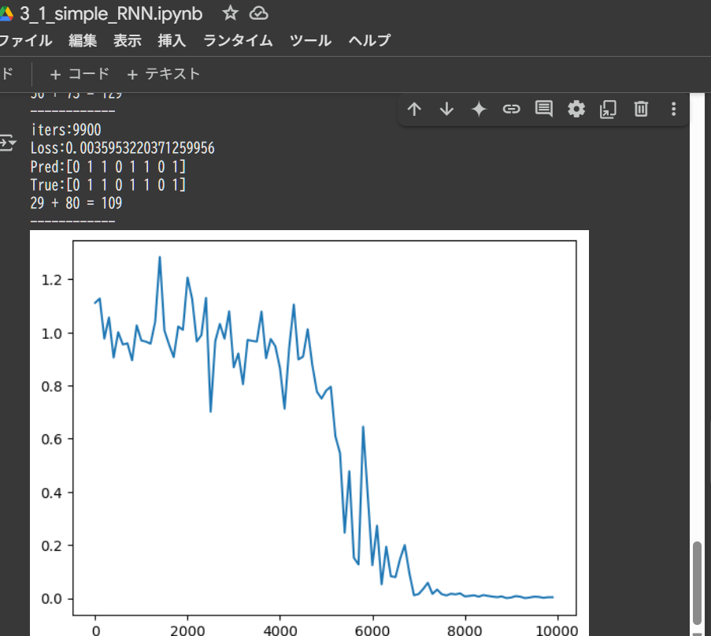

* 補足
導関数をd_tanhとしている。
数値 (x) を入力として受け取り、その数値における双曲線正接関数の導関数を計算し、結果を返す関数

### 勾配爆発
勾配が、層を逆伝播するごとに指数関数的に大きくなること

## LSTM
前回の授業で触れた勾配消失の解決方法とは、 別で、構造自体を変えて解決したものがLSTM

# Section2 : LSTM
([目次に戻る](#目次))

## 確認テスト
シグモイド関数を微分した時、入力値が0の時に最大値をとる。その値として正しいものを選択肢から選べ。（1分）

(1) 0.15
(2) 0.25
(3) 0.35
(4) 0.45

* 解答:
  (2) 0.25

$$
\sigma(x) = \frac{1}{1 + e^{-x}}
$$

$$
\sigma'(x) = \frac{d}{dx} \left( \frac{1}{1 + e^{-x}} \right) = \frac{e^{-x}}{(1 + e^{-x})^2} = \sigma(x)(1 - \sigma(x))

x = \frac{1}{2}で最大値のため、\frac{1}{4}

$$


## 演習チャレンジ
RNNや深いモデルでは勾配消失または爆発が起こる傾向がある。勾配爆発を防ぐために勾配のクリッピングを行う手法がある。具体的には勾配のノルムがしきい値を超えたら、勾配のノルムをしきい値に正規化するというものである。以下のコードの（き）にあてはまるのはどれか。

```python
def gradient_clipping(grad, threshold):
    """
    grad: gradient
    threshold: threshold
    """
    norm = np.linalg.norm(grad)
    rate = threshold / norm
    if rate < 1:
        clipped_grad = # (き)
        return clipped_grad
    return grad
(1) gradient * rate
(2) gradient / norm
(3) gradient / threshold
(4) np.maximum(gradient, threshold)
```

- 正解: 1
【解説】 勾配のノルムがしきい値より大きいときは、勾配のノルムをしきい値に正規化するので、クリッピングした勾配は、勾配$\times$(しきい値/勾配のノルム)と計算される。つまり、gradient * rateである。


## CECの課題
- 入力データについて、 時間依存度に関係なく重みが一律である。
ニューラルネットワークの学習特性が無いということ

## 入力・出力ゲート
入力・出力ゲートを追加することで、 それぞれのゲートへの入力値の重みを、 重み行列W,Uで可変可能とする。
⇓
CECの課題を解決。

## 忘却ゲート
* LSTMブロックの課題
過去の情報が要らなくなった場合、削除することはできず、 保管され続ける。

* LSTMの現状
  CECは、過去の情報が全て保管されている。
* 解決策
  過去の情報が要らなくなった場合、そのタイミングで情報を忘却する
  機能が必要。
  → 忘却ゲートの誕生
  
## 確認テスト
* 以下の文章をLSTMに入力し空欄に当てはまる単語を予測したいとする。
文中の「とても」という言葉は空欄の予測において
なくなっても影響を及ぼさないと考えられる。
このような場合、どのゲートが作用すると考えられるか。
「映画おもしろかったね。ところで、とてもお腹が空いたから何か____。」

* 忘却ゲート

## 演習チャレンジ

以下のプログラムはLSTMの順伝播を行うプログラムである。ただし、`_sigmoid`関数は要素ごとにシグモイド関数を作用させる関数である。

（け）にあてはまるのはどれか。

```python
def lstm(x, prev_h, prev_c, W, U, b):
    # x: inputs (batch_size, input_size)
    # prev_h: hidden outputs at the previous time step, (batch_size, state_size)
    # prev_c: cell states at the previous time step, (batch_size, state_size)
    # W: upward weights, (4*state_size, input_size)
    # U: lateral weights, (4*state_size, state_size)
    # b: bias, (4*state_size,)

    lstm_in = _activation(x.dot(W.T) + prev_h.dot(U.T) + b)
    a, i, f, o = np.split(lstm_in, 4, 1)

    # ゲートを適用
    input_gate = _sigmoid(i)
    forget_gate = _sigmoid(f)
    output_gate = _sigmoid(o)

    # セルの状態を更新
    c = # (け)
    h = output_gate * np.tanh(c)

    return h, c
(1) output_gate * a + forget_gate * c
(2) forget_gate * a + output_gate * c
(3) input_gate * a + forget_gate * c
(4) forget_gate * a + input_gate * c
```
正解: 3

新しいセルの状態は、計算されたセルへの入力 a と1ステップ前のセルの状態 c に入力ゲート、忘却ゲートを掛けて足し合わされたものと表現される。つまり、input_gate * a + forget_gate * c である。


* 上記について
入力と重みの結合:
- x.dot(W.T): 現在の入力 x に入力重み W の転置の積
- W は入力ゲート、入力変調、忘却ゲート、出力ゲートに対応する重みが垂直方向に結合された行列
prev_h.dot(U.T): 前の隠れ状態prev_h と再帰的な重みU の転置の積
※Uも同様に各ゲートに対応する重みが結合された行列
- b: 各ゲートのバイアスが結合されたベクトル
- lstm_in = _activation(...): 上記の結合された結果に_activation 関数（通常はtanhなど）を適用
- ※ lstm_in は、入力ゲート、入力変調、忘却ゲート、出力ゲートへの入力が結合されたもの

ゲートへの入力の分割:
* a, i, f, o = np.split(lstm_in, 4, 1): 結合された lstm_in を、入力変調 (a), 入力ゲート (i), 忘却ゲート (f), 出力ゲート (o) の4つの部分に分割
- np.split の 4 は分割数、1 は列方向への分割

ゲートの活性化:
* input_gate = _sigmoid(i): 入力ゲート i にシグモイド関数 _sigmoid を適用し、0から1の範囲の値を出力
(どの程度の新しい情報をセル状態に加えるかを制御)
* forget_gate = _sigmoid(f): 忘却ゲート f にシグモイド関数 _sigmoid を適用し、0から1の範囲の値を出力します。これは、前のセル状態のどの情報を保持するかを制御します。
* output_gate = _sigmoid(o): 出力ゲート o にシグモイド関数 _sigmoid を適用し、0から1の範囲の値を出力
  (セル状態のどの情報を隠れ状態として出力するかを制御)

セルの状態の更新:
* c = input_gate * a + forget_gate * prev_c: 現在のセルの状態 c を計算
* input_gate * a: 現在の入力 x から変換された情報 (a) に入力ゲートの出力を掛けることで、新しいセル状態に加えるべき情報の量を調整
* forget_gate * prev_c: 前のセルの状態 prev_c に忘却ゲートの出力を掛けることで、保持すべき過去の情報の量を調整

隠れ状態の出力:
* h = output_gate * np.tanh(c): 現在の隠れ状態 h を計算
* np.tanh(c): 現在のセルの状態 c にtanh関数を適用し、-1から1の範囲の値に変換
* output_gate * np.tanh(c): 上記の結果に出力ゲートの出力を掛けることで、セル状態から出力する情報の量を調整

戻り値:
* return h, c: 現在のタイムステップの隠れ状態 h とセルの状態 c


## 参考文献からの補足
ゼロから作るDeep Learning 2――自然言語処理編からの補足
- 基本的な活性化関数として: 自然言語処理の基礎となるニューラルネットワークの要素として、シグモイド関数が基本的な非線形変換を行う関数の一つとして紹介されることがあります。
- RNNのゲート機構: 例えば、LSTM（Long Short-Term Memory）やGRU（Gated Recurrent Unit）といったRNNの発展形では、シグモイド関数がゲートの活性化関数として重要な役割を果たします。これらのゲートは、過去の情報をどれだけ保持するか、新しい情報をどれだけ取り込むかなどを制御するために、0から1の間の値を出力する必要があります。シグモイド関数はこの目的に適しており、情報の流れを滑らかに制御するために利用されます。
- 出力層での利用（二値分類）: テキストの感情分析（ポジティブ/ネガティブ）のような二値分類問題では、最終的な出力を0から1の確率として解釈するために、出力層の活性化関数としてシグモイド関数が用いられることがあります。


## 覗き穴結合
CECの保存されている過去の情報を、 任意のタイミングで他のノードに伝播させたり、
あるいは任意のタイミングで忘却させたい。
CEC自身の値は、ゲート制御に影響を与えていない。

### 覗き穴結合とは？
CEC自身の値に、重み行列を介して伝播可能にした構造。


# Section3 : GRU
([目次に戻る](#目次))

## LSTMの課題
LSTMでは、パラメータ数が多く、計算負荷が高くなる問題があった。

## GRU
  計算負荷が低い。
* GRUとは？
  従来のLSTMでは、パラメータが多数存在していたため、計算負荷が大きかった。しかし、GRUでは、そのパラメータを大幅に削減し、精度は同等またはそれ以上が望める様になった構造。


## 確認テスト
LSTMとCECが抱える課題について、それぞれ簡潔に述べよ。

LSTM:
パラメータ数が多く、計算負荷が高くなる
CEC: 
時間依存度に関係なく重みが一律で学習特性がない


## 演習チャレンジ
GRU (Gated Recurrent Unit) はLSTMと同様にRNNの一種であり、勾配消失問題を軽減する目的で開発された。LSTMに比べてパラメータ数が少なく、より単純な構造であるが、タスクによってはLSTMより良い性能を発揮する。以下のプログラムはGRUの順伝播を行うプログラムである。ただし、`_sigmoid`関数は要素ごとにシグモイド関数を作用させる関数である。

（こ）にあてはまるのはどれか。

```python
def gru(x, h_prev, W_r, U_r, W_z, U_z, W, U):
    # x: inputs (batch_size, input_size)
    # h_prev: hidden outputs at the previous time step, (batch_size, state_size)
    # W_r, U_r: weights for reset gate
    # W_z, U_z: weights for update gate
    # W, U: weights for new state

    # ゲートを計算
    r = _sigmoid(x.dot(W_r.T) + h_prev.dot(U_r.T))
    z = _sigmoid(x.dot(W_z.T) + h_prev.dot(U_z.T))

    # 新しい記憶状態を計算
    h_bar = np.tanh(x.dot(W.T) + (r * h_prev).dot(U.T))
    h_new = # (こ)
    return h_new
(1) z * h_bar
(2) (1 - z) * h_bar
(3) z * h_bar
(4) (1 - z) * h_prev + z * h_bar
```

解答
正解: 4

【解説】 新しい隠れ状態は、1ステップ前の隠れ状態と計算された中間表現の線形和で表現される。つまり更新ゲート $$z$$ を用いて、 $$(1 - z) * h_{prev} + z * h_{bar}$$ と書ける。

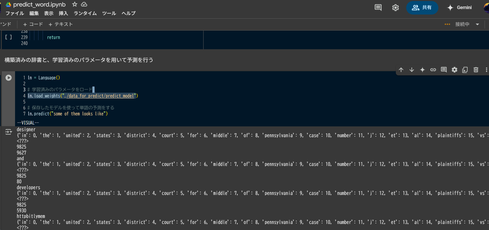


# Section4 : 双方向RNN
([目次に戻る](#目次))

## 双方向RNN

過去の情報だけでなく、未来の情報を加味することで、精度を向上させるためのモデル

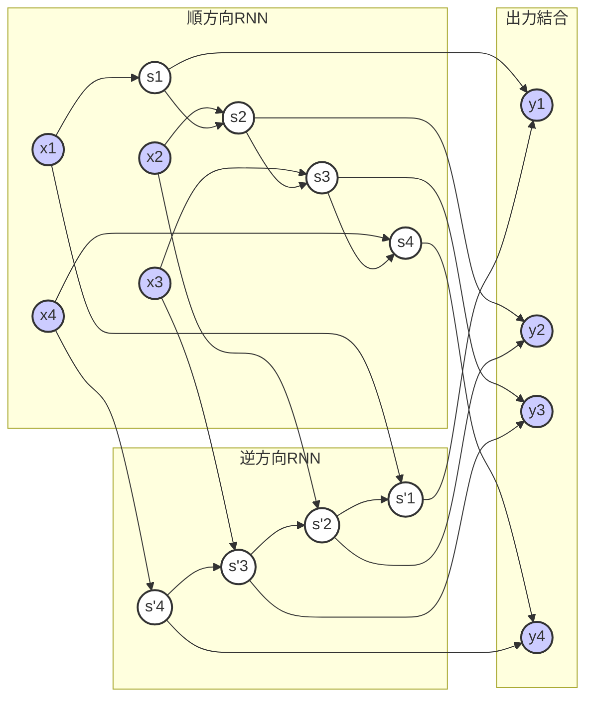
```mermaid
graph LR
    subgraph 順方向RNN
        direction LR
        x1((x1)) --> s1_f((s1))
        x2((x2)) --> s2_f((s2))
        x3((x3)) --> s3_f((s3))
        x4((x4)) --> s4_f((s4))
        s1_f --> s2_f
        s2_f --> s3_f
        s3_f --> s4_f
    end

    subgraph 逆方向RNN
        direction LR
        x1((x1)) --> s1_b((s'1))
        x2((x2)) --> s2_b((s'2))
        x3((x3)) --> s3_b((s'3))
        x4((x4)) --> s4_b((s'4))
        s4_b --> s3_b
        s3_b --> s2_b
        s2_b --> s1_b
    end

    subgraph 出力結合
        direction TB
        s1_f --> y1((y1))
        s1_b --> y1
        s2_f --> y2((y2))
        s2_b --> y2
        s3_f --> y3((y3))
        s3_b --> y3
        s4_f --> y4((y4))
        s4_b --> y4
    end

    style s1_f fill:#fff,stroke:#333,stroke-width:2px
    style s2_f fill:#fff,stroke:#333,stroke-width:2px
    style s3_f fill:#fff,stroke:#333,stroke-width:2px
    style s4_f fill:#fff,stroke:#333,stroke-width:2px
    style s1_b fill:#fff,stroke:#333,stroke-width:2px
    style s2_b fill:#fff,stroke:#333,stroke-width:2px
    style s3_b fill:#fff,stroke:#333,stroke-width:2px
    style s4_b fill:#fff,stroke:#333,stroke-width:2px
    style y1 fill:#ccf,stroke:#333,stroke-width:2px,shape:rect
    style y2 fill:#ccf,stroke:#333,stroke-width:2px,shape:rect
    style y3 fill:#ccf,stroke:#333,stroke-width:2px,shape:rect
    style y4 fill:#ccf,stroke:#333,stroke-width:2px,shape:rect
    style x1 fill:#ccf,stroke:#333,stroke-width:2px
    style x2 fill:#ccf,stroke:#333,stroke-width:2px
    style x3 fill:#ccf,stroke:#333,stroke-width:2px
    style x4 fill:#ccf,stroke:#333,stroke-width:2px
```


## コード演習問題

以下は双方向RNNの順伝播を行うプログラムである。順方向については、入力から中間層への重み`W_f`、前のステップの中間層から中間層への重み`U_f`、逆方向に関しては同様にパラメータ`W_b`、`U_b`を持ち、両者の中間層表現を合わせた特徴量が出力層への重み`V`である。RNN関数はRNNの順伝播の系列を返す関数であるとする。（か）にあてはまるのはどれか。

```python
def bidirectional_rnn_net(xs, W_f, U_f, W_b, U_b, V):
    # W_f, U_f: forward rnn weights, (hidden_size, input_size), (hidden_size, hidden_size)
    # W_b, U_b: backward rnn weights, (hidden_size, input_size), (hidden_size, hidden_size)
    # V: output weights, (output_size, 2*hidden_size)
    n_time = len(xs)
    h_f = np.zeros((n_time, U_f.shape[0]))
    h_b = np.zeros((n_time, U_b.shape[0]))
    ys = np.zeros((n_time, V.shape[0]))

    for i, x in enumerate(xs):
        h_f[i] = _rnn(x, h_f[i-1], W_f, U_f)
        h_b[n_time - 1 - i] = _rnn(xs[n_time - 1 - i], h_b[n_time - i], W_b, U_b)

    h_concat = # (か)
    for i, h_f_i, h_b_i in zip(range(n_time), h_f, h_b):
        hs = np.concatenate((h_f_i, h_b_i), axis=0)
        ys[i] = hs.dot(V.T)
    return ys
(1) h_f + h_b[::-1]
(2) h_f * h_b[::-1]
(3) np.concatenate([h_f, h_b[::-1]], axis=1)
(4) np.concatenate([h_f, h_b[::-1]], axis=0)
```

正解: 3

双方向RNNでは、順方向と逆方向に伝播したときの中間層表現をあわせたものが特徴量となる。
np.concatenate([h_f, h_b[::-1]], axis=1) である。

# Section5 : Seq2Seq
([目次に戻る](#目次))


- Seq2seqとは
  Seq2seqの具体的な用途とは?
  機械対話や、機械翻訳などに使用されている。
- Seq2seqとは?
  Encoder-Decoderモデルの一種を指します。

## Encoder RNN
ユーザーがインプットしたテキストデータを、単語等のトークンに区切って渡す構造。

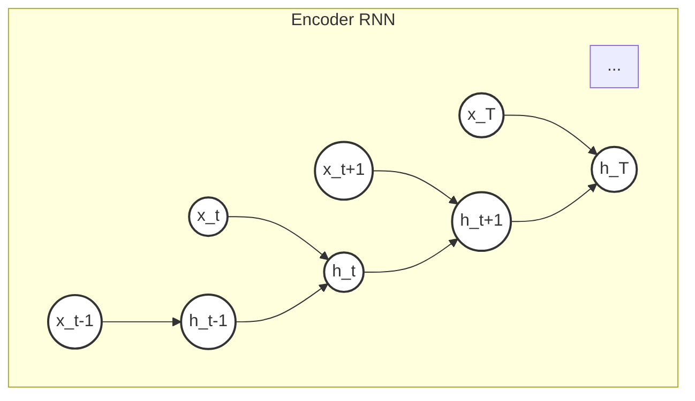
```mermaid
graph LR
    subgraph Encoder RNN
        direction LR
        x_t_minus_1((x_t-1)) --> h_t_minus_1((h_t-1))
        x_t((x_t)) --> h_t((h_t))
        x_t_plus_1((x_t+1)) --> h_t_plus_1((h_t+1))
        x_T((x_T)) --> h_T((h_T))
        h_t_minus_1 --> h_t
        h_t --> h_t_plus_1
        h_t_plus_1 --> h_T
        subgraph ...
            direction LR
            style x_t_minus_1 fill:#fff,stroke:#333,stroke-width:2px
            style h_t_minus_1 fill:#fff,stroke:#333,stroke-width:2px
            style x_t fill:#fff,stroke:#333,stroke-width:2px
            style h_t fill:#fff,stroke:#333,stroke-width:2px
            style x_t_plus_1 fill:#fff,stroke:#333,stroke-width:2px
            style h_t_plus_1 fill:#fff,stroke:#333,stroke-width:2px
            style x_T fill:#fff,stroke:#333,stroke-width:2px
            style h_T fill:#fff,stroke:#333,stroke-width:2px
        end
    end
```
例:

昨日 -> 食べ -> た -> 刺身 -> 大丈夫 -> でした -> か -> 。

- Taking: 文章を単語等のトークン毎に分割し、トークンごとのIDに分割する。
- Embedding: IDから、そのトークンを表す分散表現ベクトルに変換。
- Encoder RNN: ベクトルを順番にRNNに入力していく。

### Encoder RNN処理手順
* vec1をRNNに入力し、hidden stateを出力。
このhidden stateと次の入力vec2をまたRNNに入力してきたhidden stateを出力という流れを繰り返す。
* 最後のvecを入れたときのhidden stateをfinal stateとし てとっておく。
* このfinal stateがthought vectorと呼ばれ、 入力した文の意味を表すベクトルとなる。


## Decoder RNN
システムがアウトプットデータを、
単語等のトークンごとに生成する構造。

### Decoder RNNの処理
1. Decoder RNN: Encoder RNN の final state (thought vector) から、各token の生成確率を出力
  final state を Decoder RNN の initial state ととして設定し、Embedding を入力。
2. Sampling: 生成確率にもとづいて token をランダムに選びます。
3. Embedding: 2で選ばれた token を Embedding して Decoder RNN への次
の入力とします。
4. Detokenize: 1 -3 を繰り返し、 2で得られた token を文字列に直します。

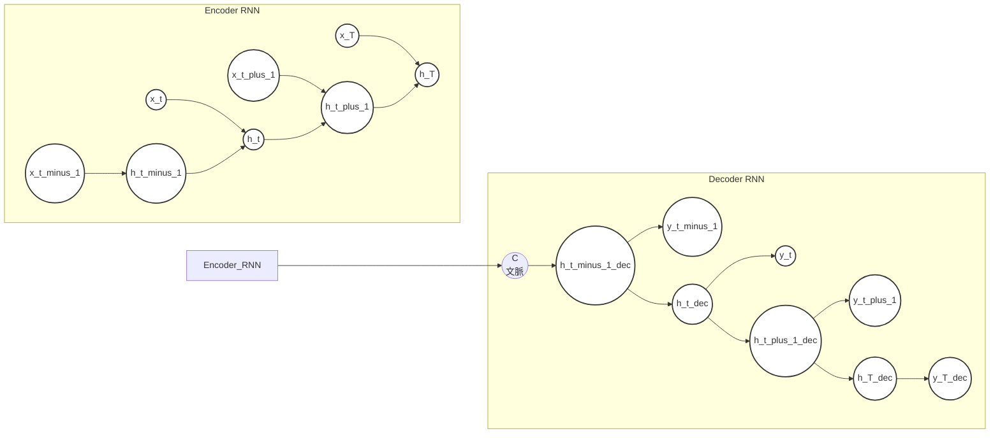
```mermaid
  graph LR
    subgraph Encoder RNN
        direction LR
        x_t_minus_1((x_t_minus_1)) --> h_t_minus_1((h_t_minus_1))
        x_t((x_t)) --> h_t((h_t))
        x_t_plus_1((x_t_plus_1)) --> h_t_plus_1((h_t_plus_1))
        x_T((x_T)) --> h_T((h_T))
        h_t_minus_1 --> h_t
        h_t --> h_t_plus_1
        h_t_plus_1 --> h_T
        style x_t_minus_1 fill:#fff,stroke:#333,stroke-width:2px
        style h_t_minus_1 fill:#fff,stroke:#333,stroke-width:2px
        style x_t fill:#fff,stroke:#333,stroke-width:2px
        style h_t fill:#fff,stroke:#333,stroke-width:2px
        style x_t_plus_1 fill:#fff,stroke:#333,stroke-width:2px
        style h_t_plus_1 fill:#fff,stroke:#333,stroke-width:2px
        style x_T fill:#fff,stroke:#333,stroke-width:2px
        style h_T fill:#fff,stroke:#333,stroke-width:2px
    end

    C((C\n文脈))
    Encoder_RNN --> C

    subgraph Decoder RNN
        direction LR
        h_t_minus_1_dec((h_t_minus_1_dec)) --> y_t_minus_1((y_t_minus_1))
        h_t_dec((h_t_dec)) --> y_t((y_t))
        h_t_plus_1_dec((h_t_plus_1_dec)) --> y_t_plus_1((y_t_plus_1))
        h_T_dec((h_T_dec)) --> y_T_dec((y_T_dec))
        C --> h_t_minus_1_dec
        h_t_minus_1_dec --> h_t_dec
        h_t_dec --> h_t_plus_1_dec
        h_t_plus_1_dec --> h_T_dec
        style h_t_minus_1_dec fill:#fff,stroke:#333,stroke-width:2px
        style y_t_minus_1 fill:#fff,stroke:#333,stroke-width:2px,shape:rect
        style h_t_dec fill:#fff,stroke:#333,stroke-width:2px
        style y_t fill:#fff,stroke:#333,stroke-width:2px,shape:rect
        style h_t_plus_1_dec fill:#fff,stroke:#333,stroke-width:2px
        style y_t_plus_1 fill:#fff,stroke:#333,stroke-width:2px,shape:rect
        style h_T_dec fill:#fff,stroke:#333,stroke-width:2px
        style y_T_dec fill:#fff,stroke:#333,stroke-width:2px,shape:rect
    end
```


## 確認テスト
下記の選択肢から、seq2seqについて説明しているものを選べ。
（1）時刻に関して順方向と逆方向のRNNを構成し、それら2つの中間層表現を特徴量として利用
するものである。
（2）RNNを用いたEncoder-Decoderモデルの一種であり、機械翻訳などのモデルに使われる。
（3）構文木などの木構造に対して、隣接単語から表現ベクトル（フレーズ）を作るという演算を再
帰的に行い（重みは共通）、文全体の表現ベクトルを得るニューラルネットワークである。
（4）RNNの一種であり、単純なRNNにおいて問題となる勾配消失問題をCECとゲートの概念を
導入することで解決したものである

正解：（2）RNNを用いたEncoder-Decoderモデルの一種であり、機械翻訳などのモデルに使われる。

(1)双方向
(3)構文木
(4)LSTM

## 確認テスト
機械翻訳タスクにおいて、入力は複数の単語から成る文（文章）であり、それぞれの単語はone-hotベクトルで表現されている。Encoderにおいて、それらの単語は単語埋め込みにより特徴量に変換され、そこからRNNによって（ここでは単純なRNNを使うとする）時系列の情報を保つ特徴量へとエンコードされる。以下は、入力である文（文章）を時系列の特徴量へとエンコードする関数である。ただし、`_activation`関数はなんらかの活性化関数であるとする。（き）にあてはまるのはどれか。

```python
def encode(words, E, W, U, b):
    # words: sequence words (sentence), one-hot vector, (n_words, vocab_size)
    # E: word embedding matrix, (embed_size, vocab_size)
    # W: upward weights, (hidden_size, embed_size)
    # U: lateral weights, (hidden_size, hidden_size)
    # b: bias, (hidden_size,)
    n_words = words.shape[0]
    hidden_size = W.shape[0]
    h = np.zeros(hidden_size)
    for w in words:
        e = # (き)
        h = _activation(W.dot(e) + U.dot(h) + b)
    return h
(1) E.dot(w)
(2) E.T.dot(w)
(3) w.dot(E.T)
(4) E * w
```

正解: 1
単語はone-hotベクトルであり、それを単語埋め込みにより別の特徴量に変換する。
これは埋め込み行列 E を用いて、E.dot(w) と書ける。


## HRED
### seq2seq課題
一問一答しかできない
-> 問に対して文脈も何もなく、ただ応答が行われる続ける。
↓
HRED

### HREDとは？
過去 n-1 個の発話から次の発話を生成する。

-> Seq2seq では、会話の文脈無視で、応答がなされたが、HRED では、前の単語の流れに即して応答されるため、より人間らしい文章が生成される。

例)
システム: インコかわいいよね。
ユーザー: うん
システム: インコかわいいのわかる。

### HREDの構造
* Context RNN: 
  Encoder のまとめた各文章の系列をまとめる
  → これまでの会話コンテキスト全体を表すベクトルに変換する
### HREDとは？
Seq2Seq+ Context RNN
### HREDの課題
HRED は確率的な多様性が字面にしかなく、会 話の「流れ」のような多様性が無い。
同じコンテキスト（発話リスト）を与えられても、
答えの内容が毎回会話の流れとしては同じものしか出せない。

HRED は短く情報量に乏しい答えをしがちである。
短いよくある答えを学ぶ傾向が
ある。
ex)「うん」「そうだね」「・・・」など。


## VHRED
HREDに、VAEの潜在変数の概念を追加したもの。
→ HREDの課題を、 VAEの潜在変数の概念を追加することで解決した構造。

## 確認テスト

**Seq2SeqとHREDの違い:**
* **Seq2Seq:** 単一のRNNをエンコーダ・デコーダとして使用し、文や文章を1系列として扱う。長い文章は無理。
* **HRED:** Seq2Seqを階層構造に拡張したため、文単位のRNN（文エンコーダ）と文間のRNN（コンテキストエンコーダ）を持ち、複数の文（会話履歴など）を文脈として扱える

**HREDとVHREDの違い:**
* **HRED:** 複数の文脈を考慮できますが、出力の多様性は限定的です。
* **VHRED:** HREDに潜在変数（latent variable）を導入したモデルです。潜在空間からサンプリングすることで、同じ入力に対して多様な応答を生成できます。確率的な生成モデルであり、応答の多様性が増す点がHREDとの大きな違いです。

| モデル  | 特徴                             | 文脈処理 | 多様性表現 |
| :------ | :------------------------------- | :------- | :--------- |
| Seq2Seq | 単一系列の変換                   | ✕        | ✕          |
| HRED    | 文脈（複数文）を考慮した階層構造 | ○        | ✕          |
| VHRED   | 潜在変数による多様性の拡張       | ○        | ○          |


## オートエンコーダ
教師なし学習の一つ。
そのため学習時の入力データは訓練データのみで教師データは利用しない。

- オートエンコーダ具体例:
MNISTの場合、28x28の数字の画像を入れて、 同じ画像を出力するニューラルネットワークということになります。

### オートエンコーダ構造
※zの次元が入力データより小さい場合、次元削減とみなすこと
ができる。
* メリット
  次元削減が行えること。
### オートエンコーダ構造説明
入力データから潜在変数zに変換するニューラルネットワークをEncoder
逆に潜在変数zをインプットとして元画像を復元するニューラルネットワークをDecoder。
### オートエンコーダ追加資料
#### 学習の目標
* 入力データと再構築したデータを比較し、その誤差を最小化すること

#### 学習のステップ
1.  エンコーダの学習：潜在変数の抽出
2.  デコーダの学習：データの再構築
3.  誤差の計算：入力データと出力データ（再構築されたデータ）を比較
4.  パラメータ更新：誤差の値を元にエンコーダとデコーダのパラメータを更新

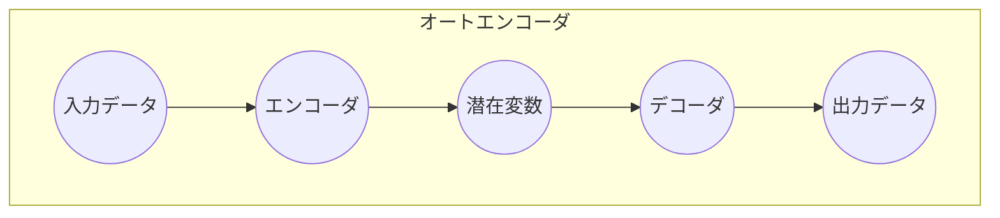
```mermaid
graph LR
    subgraph オートエンコーダ
        direction LR
        入力データ((入力データ)) --> エンコーダ((エンコーダ)) --> 潜在変数((潜在変数)) --> デコーダ((デコーダ)) --> 出力データ((出力データ))
    end
```
#### オートエンコーダの構造

オートエンコーダのエンコーダとデコーダは、入力データを潜在表現にエンコードし、それを再構築データにデコードする役割を担っている。

### オートエンコーダの構造

| **エンコーダ** | **デコーダ**                     |
| -------------- | -------------------------------- |
| **入力**       | 元データ                         | 潜在変数                                                          |
| **出力**       | 潜在変数                         | 再構築データ                                                      |
| **機能**       | 次元圧縮、特徴抽出               | データ生成                                                        |
| **構造**       | 多層のニューラルネットワーク構造 | 多層のニューラルネットワーク構造 (エンコーダの構造を逆にした構造) |

#### 構造図

**エンコーダ**
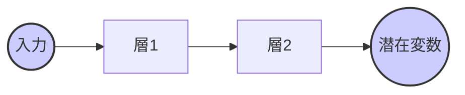
```mermaid
graph LR
  入力((入力)) --> 層1
  層1 --> 層2
  層2 --> 潜在変数((潜在変数))
  style 入力 fill:#ccf,stroke:#333,stroke-width:2px
  style 潜在変数 fill:#ccf,stroke:#333,stroke-width:2px
```

**デコーダ**
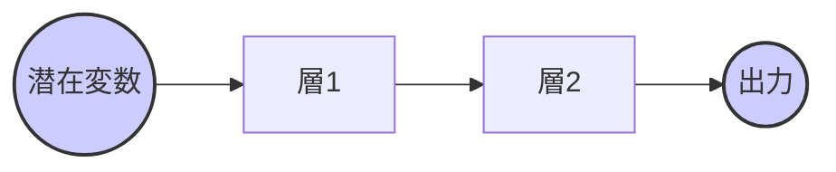
```mermaid
graph LR
  潜在変数((潜在変数)) --> 層1
  層1 --> 層2
  層2 --> 出力((出力))
  style 潜在変数 fill:#ccf,stroke:#333,stroke-width:2px
  style 出力 fill:#ccf,stroke:#333,stroke-width:2px
```

## VAEの学習方法
VAEの学習は、入力データに対する条件付き確率分布を調整し、尤度を最大にすることを目安として行われる。

### 学習の目標

* 条件付き確率分布のパラメータを調整し、尤度を最大にするパラメータを探すこと

### 学習の方法
* デコーダ（パラメータ $\theta$ を持つ）：$p(x|z)$
* エンコーダ（パラメータ $\phi$ を持つ）：$q(z|x)$
* 以下の目的関数を最大化するパラメータ ($\theta$、$\phi$) を探し出す。

$$
\log p(x)
$$

$$
\log p(x) = \log \int q(z|x) \frac{p(x, z)}{q(z|x)} dz = \int q(z|x) \log \frac{p(x, z)}{q(z|x)} dz
$$

$$
= \int q(z|x) \frac{p(x|z) p(z)}{q(z|x)} dz = \int q(z|x) \left( \log \frac{p(x|z) p(z)}{q(z|x)} \right) dz
$$

$$
= \int q(z|x) \left( \log \frac{p(x|z)}{q(z|x)} + \log p(z) \right) dz = \int q(z|x) \log p(x|z) dz - \int q(z|x) \log \frac{q(z|x)}{p(z)} dz
$$

$$
= \mathbb{E}_{q(z|x)} [\log p(x|z)] - D_{KL}(q(z|x) || p(z))
$$

$$
= - D_{KL}(q(z|x) || p(z)) + \mathcal{L}(x, z)
$$

* VAEでは、変分下限の値を最大化するようにパラメータの更新を行い学習を行う。

* 変分下限（ELBO）の最大化
  目的関数：$D_{KL}(q(z|x) || p(z)) + \mathcal{L}(x, z)$
  第1項：KLダイバージェンス（事後分布を含むため計算不可）、第2項：変分下限（ELBO）
  $\rightarrow D_{KL}(q(z|x) || p(z)) \geq 0$ が成り立つので、目的関数を最大化するには、「変分下限」の値を最大化する必要がある。

* 変分下限（ELBO）
変分下限は以下の様に分解できる

$$
\mathcal{L}(x, z) = \mathbb{E}{q(z|x)} [\log p(x|z)] - D{KL}(q(z|x) || p(z))
$$

$$
= \int q(z|x) \log p(x|z) dz - \int q(z|x) \log \frac{q(z|x)}{p(z)} dz
$$

$$
= \mathbb{E}{q(z|x)} [\log p(x|z)] - \mathbb{E}{q(z|x)} [\log q(z|x) - \log p(z)]
$$

$$
= \mathbb{E}{q(z|x)} [\log p(x|z)] - D{KL}(q(z|x) || p(z))
$$

### Reparametrization trick

Reparametrization trick は、確率分布からのサンプリングを微分可能な操作に変換する手法である。

### Reparametrization trick の役割

* VAEでは、エンコーダが潜在変数の確率分布のパラメータである「平均」と「分散」を出力し、デコーダがその分布からサンプリングした潜在変数を用いてデータを生成する。
* 正規分布からのサンプリングには乱数が介入するため、そのままでは微分不可能である。
* $\rightarrow$Reparametrization trick を使用することで、サンプリングの操作を微分可能にする。

### Denoising Autoencoder
Denoising Autoencoder (DAE) は、オートエンコーダの一種で、主にノイズの除去に焦点を当てたモデルである。

### Denoising Autoencoder (DAE) とは
オートエンコーダの一種で、主にノイズの除去に焦点を当てたモデルである。
意図的にノイズを入れたデータを入力とし、ノイズ無しのデータを正解データとすることで、ノイズを除去したデータを出力できるように学習させる。
入力データに制約（ノイズなど）を適用し、入力データの特徴を学習するという点で、制約付きボルツマンマシン (RBM) と似たような構造や学習の目標を持っているため、結果がほぼ一致する。

- 潜在空間での分布例
例) 手書き数字(MNIST)のデータセット
- オートエンコーダやVAEにおいて、手書き数字の画像を学習した場合を考える。
- 潜在変数が2次元であった場合、VAEでは、数字の種類ごと正規分布に従
って分布するイメージとなる。
VAEでは、潜在空間内に各ラベルのデータが正規分布に従って分布する。
潜在空間の調整◼ 潜在変数を調整して特徴量を持つ出力を生成する方法

●以下のステップで生成する。
1. 潜在変数の取得：生成したい画像を用いてVAEを学習し、潜在変数のマッピングを取得する。
2. 潜在変数の特定の成分の変更：潜在変数の特徴を変更し、特定の部分の強調を行う。
3. 潜在変数から画像の作成：調整した潜在変数から画像の生成を行う。

例)手書き数字「6」の生成
1. VAEのエンコーダを使用してMNISTの数字「6」の潜在変数zを取得
2. 潜在変数zの特定の特徴を調整して、丸の閉じる部分がはっきりするように変更
3. 変更された潜在変数zから画像を生成し、希望の特徴を持つ「6」を出力
調整した潜在変数から画像の生成を行うことで、特定の部分が強調されたデータを得ることができる。


## VAE
通常のオートエンコーダーの場合、何かしら潜在変数$z$にデータを押し込めているものの、その構造がどのような状態かわからない。
↓
VAEはこの潜在変数$z$に確率分布$\mathcal{N}(0, 1)$を仮定したもの。
-> VAEは、データを潜在変数$z$の確率分布という構造に押し込めることを可能にします。
※Variable Auto Encoderの略！

### メモ
Encoderの出力に対して、Decoderの入力にランダム性をもたせる
→ ノイズを加える


## 確認テスト
VAEに関する下記の説明文中の空欄に当てはまる言葉を答えよ。
自己符号化器の潜在変数に____を導入したもの。
- 確率分布


# Section6 : Word2vec
([目次に戻る](#目次))

## RNNにおける可変長入力の課題

RNN（リカレントニューラルネットワーク）では、単語のような可変長の文字列をそのままニューラルネットワークに与えることはできません。そのため、単語を固定長の形式で表現する必要があります。

学習データからボキャブラリ（語彙）を作成します。

**例:**
I want to eat apples. I like apples.

**作成されたボキャブラリ (7語の例):**
{apples, eat, I, like, to, want, .}

※実際には、学習データに含まれる辞書の単語数だけのボキャブラリが作成されます。

※実際には、作成されたボキャブラリの単語数だけの要素を持つone-hotベクトルが作成され、該当する単語の位置が1、それ以外は0となります。

**メリット:**
word2vecは、大規模なテキストデータから単語の分散表現を学習することを、現実的な計算速度とメモリ量で実現可能にしました。

**従来の課題:**
✗ ボキャブラリ数 × ボキャブラリ数の巨大な重み行列が生成されてしまう。

**word2vecの解決策:**
○ ボキャブラリ数 × 任意の単語ベクトルの次元数の重み行列を生成する。

**処理のイメージ:**
[0, 0, ..., 1 (applesの位置), ..., 0]  * (ボキャブラリ数 × 単語ベクトルの次元数) の重み行列
(ボキャブラリ数のone-hotベクトル)

これにより、各単語は低次元の密なベクトル（単語ベクトル）で表現され、単語間の意味的な類似性を捉えることが可能になります。

### Word Embedding

Word Embedding（単語の埋め込み）とは、文章中の単語の意味や文法を反映するように単語をベクトルに変換する手法です。

* **密な固定長のベクトル**

* **分布仮説:** 文章中の単語の意味は周囲の単語によって形成される

* **特徴① 類似性:** 同じような意味の単語は同じようなベクトルになる性質
    $$
    \frac{\mathbf{v}(\text{dog}) \cdot \mathbf{v}(\text{cat})}{||\mathbf{v}(\text{dog})|| ||\mathbf{v}(\text{cat})||} \approx 1
    $$

* **特徴② 加法構成性:** 単語間の意味のパターンを反映
    $$
    \mathbf{v}(\text{king}) - \mathbf{v}(\text{man}) + \mathbf{v}(\text{woman}) \approx \mathbf{v}(\text{queen})
    $$
    $$
    \mathbf{v}(\text{bad}) - \mathbf{v}(\text{good}) + \mathbf{v}(\text{best}) \approx \mathbf{v}(\text{worst})
    $$

### Word Embedding の手法

Word Embedding（単語の埋め込み）には、推論ベースのニューラルネットワークを用いる手法 (Word2Vec) とカウントベースの手法があります。

### 推論ベースの手法 (Word2Vec)

* **n-gramによるトークン化**
    * n = 1 (uni-gram): 1単語1トークン
    * n = 2 (bi-gram): 2単語1トークン

* **ニューラルネットワークによる推論**
    $$
    P(\text{token} B | \text{token} A)
    $$

* **CBOWとSkip Gram:** Word2Vecのモデル
    * CBOW: P(target token | context tokens)
    * Skip Gram: P(context tokens | target token)

* **ネガティブサンプリング:** Word2Vecの効率化手法
特異値分解を用いたカウントベースの手法
共起行列をカウント
特異値分解による次元削減 $X = USV^T$
## Word Embedding の手法
CBOWとskip gramは、Word2Vecのニューラルネットワークです。重みパラメータWから単語ベクトルが得られます。

* **CBOW (Continuous Bag of Words):** 周囲の複数の単語（コンテキスト）から対象の単語（ターゲット）を予測するモデル。

* **Skip gram:** 対象の単語（ターゲット）から周囲の複数の単語（コンテキスト）を予測するモデル。

* ネガティブサンプリングは、Word2Vecの学習を効率化する技術です。

### Word2Vecの問題点：辞書に含まれる単語の数nに応じて計算（行列計算やソフトマックス関数）が多くなる。
$$
P(\text{token } i) = \frac{\exp(s_i)}{\sum_{j=1}^n \exp(s_j)}
$$

正解ラベルの単語（ポジティブ）と少数のネガティブな単語だけサンプリングし、それぞれ2値分類タスクを行う。
$$
Positive: 1 \leftarrow P(\text{target}) = Sigmoid(\mathbf{W}{in}(\text{context}) \cdot \mathbf{W}{out}(\text{target}))
$$
$$
Negative: 0 \leftarrow P(\text{not target}) = Sigmoid(\mathbf{W}{in}(\text{context}) \cdot \mathbf{W}{out}(\text{not target}))
$$
## One-hotベクトルとWord Embeddingの違い

* **One-hot**
    * 疎なベクトル
* **Word Embedding**
    * 密なベクトル、類似性・加法構成性

Word2Vecのアルゴリズム
* 分布仮説
* CBOW
* Skip Gram
ネガティブサンプリング

# Section7 : Attention Mechanism
([目次に戻る](#目次))

## Attention Mechanism
**課題:** seq2seq の問題は長い文章への対応が難しいです。seq2seq では、2単語でも、100単語でも、固定次元ベクトルの中に押し込めなければならない。

**解決策:** 文章が長くなるほどそのシーケンスの内部表現の次元も大きくなっていく仕組みが必要になります。

-> Attention Mechanism
↓
「入力と出力のどの単語が関連しているのか」の関連度を学習する仕組み。
### Attention Mechanism 具体例
私  は  ペン  を  持って  いる
↓   ↓   ↓   ↓    ↓     ↓
I   have a   pen  を持って いる
※「a」については、そもそも関連度が低く、「I」については「私」との関連度が高い。


## 確認テスト
RNNとword2vec、seq2seqとAttentionの違いを簡潔に述べよ。

### RNN（Recurrent Neural Network）
時系列データを処理する基本モデル
各時刻の入力に対して、過去の状態（履歴）を反映した出力を生成
例：文の感情分析、時系列予測など

### Word2Vec
単語を意味的なベクトルに変換する手法（単語埋め込み）
文脈情報を使って単語間の意味的類似性を学習
例：類義語検索、文の類似度計算など

### Seq2Seq（Encoder-Decoder）
入力系列→出力系列に変換するモデル（翻訳、要約など）
RNNベースの構成（Encoder + Decoder）
例：英語 → 日本語の翻訳、質問応答

### Attention
Seq2Seq の強化手法
入力系列の各要素に「どの程度注目すべきか」を重み付け
長い入力文でも意味の抜け落ちを防ぐ
例：翻訳文中の単語ごとの対応強調

| モデル    | 主な役割             | 特徴                       |  RNN  | 時系列処理 | 履歴を保持して逐次処理 |
| :-------- | :------------------- | :------------------------- | :---: | :--------- | :--------------------- |
| RNN       | 時系列データの処理   | 履歴を保持して逐次処理     |   ○   | ○          | ○                      |
| Word2Vec  | 単語の意味表現       | 分布的表現、類似性が可視化 |       |            |                        |
| Seq2Seq   | 入力→出力の系列変換  | Encoder-Decoder構造        |   ○   | ○          |                        |
| Attention | 重要単語への重み付け | 長文処理を強化             |

# VQVAE)
([目次に戻る](#目次))

**VQ-VAE** は、オートエンコーダに基づく生成モデルであり、**離散的な潜在変数**を用いる点が特徴です。  
従来の VAE が連続的な潜在空間（ガウス分布）を使用するのに対し、VQ-VAE は **ベクトル量子化（Vector Quantization）** を通じて **離散的コードブック**にマッピングされる潜在空間を学習します。

これにより、次のような効果が得られます：

- 離散的表現による意味的特徴の抽出
- `posterior collapse`（強力なデコーダによって潜在変数が無視される問題）の回避


## VAE と VQ-VAE の違い

| モデル     | 潜在変数の性質                 | 学習方式                                 |
| ---------- | ------------------------------ | ---------------------------------------- |
| VAE        | 連続値（例：ガウス分布）       | $KL(q(z x) \| p(z)) + \log p(x\|z)$      |
| **VQ-VAE** | 離散値（コードブックから選択） | ベクトル量子化 + 再構成誤差 + 量子化誤差 |


## アーキテクチャ構成

### 1. Encoder
入力画像 $x$ に対して、潜在ベクトル $z_e(x) \in \mathbb{R}^D$ を出力。

### 2. Vector Quantization（ベクトル量子化）

- 事前に定義された $K$ 個の埋め込みベクトル $\{e_j\}_{j=1}^K$
- 各 $z_e(x)$ に対して、ユークリッド距離で最も近い埋め込みベクトル $e_k$ を選択：

$$
k = \arg\min_j \| z_e(x) - e_j \|_2
$$

$$
z_q(x) = e_k
$$

### 3. Decoder

量子化された潜在変数 $z_q(x)$ を入力として、元のデータ $x$ を復元。


## 学習目標と損失関数

VQ-VAE では、以下の目的関数 $L_{VQ-VAE}$ を最小化します：

$$
L_{VQ-VAE} = \log p(x | z_q(x)) + \| \text{sg}[z_e(x)] - e \|_2^2 + \beta \| z_e(x) - \text{sg}[e] \|_2^2
$$

- $\log p(x | z_q(x))$: 再構成誤差
- $\text{sg}[\cdot]$: stop gradient（誤差逆伝播しない）
- $\| \text{sg}[z_e(x)] - e \|^2$: **codebook loss**
- $\| z_e(x) - \text{sg}[e] \|^2$: **commitment loss**

> ※ $\beta$ はハイパーパラメータ（例：$0.1 < \beta < 2.0$）

##  posterior collapse の回避

通常の VAE では、デコーダが強力すぎると潜在変数を無視する `posterior collapse` が発生しますが、  
VQ-VAE は **離散的なコードブックベクトルを必ず通す構造**により、これを自然に回避できます。


## 拡張：VQ-VAE-2

- 潜在空間を階層構造に分割（複数スケール）
- 高解像度でリアルな画像生成が可能
- 論文: *Generating Diverse High-Fidelity Images with VQ-VAE-2* ([arXiv:1906.00446](https://arxiv.org/abs/1906.00446))

##  参考論文
- [**VQ-VAE**: Neural Discrete Representation Learning (arXiv:1711.00937)](https://arxiv.org/abs/1711.00937)
- [**VQ-VAE-2**: Genera


# 【フレームワーク演習】双方向RNN / 勾配のクリッピング
([目次に戻る](#目次))
- `spoken_digit`データセットを用いてRNNを実装する
spoken_digitデータセットをロードし、トレーニング、検証、テストデータに分割
※データ
audio: 数千単位時間(サンプル時間;タイムステップ 非常に短い時間の音声)の音声データ
audio/filname: 音声ファイルのファイル名
label: 対応する数字のラベル

- 前処理
音声データをすべて1000単位時間にそろえる
※長すぎるデータは途中で切り落とし、短すぎるデータには、後ろに0を付け足す

また、ミニバッチによる学習を行うため、8個でミニバッチを構築
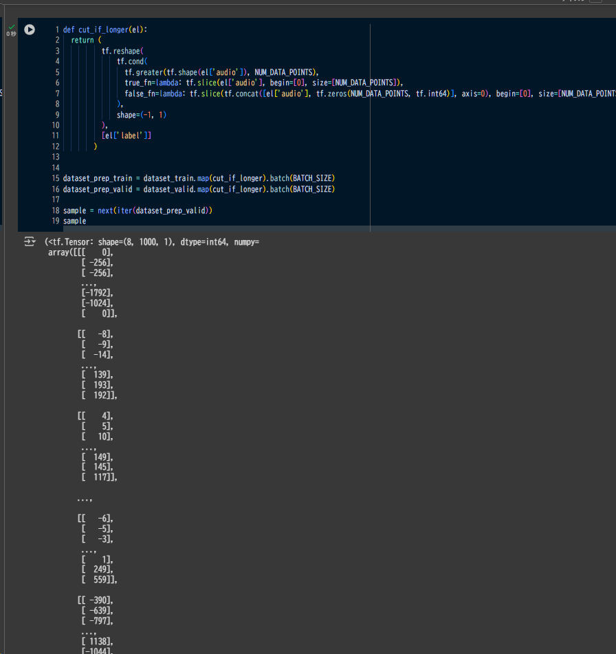

- 1次元畳み込みニューラルネットワーク (Conv1D)
1層の畳み込み層とMaxPooling層で一次元の畳み込み
  - 畳み込み層: 4要素に対して、32個のフィルターで特徴量を抽出
  - 畳み込み層 → 出力層に至る接続: GlobalAveragePooling層(Flatten層と同様に、複数のフィルターで捉えられたデータを1列に抽出し、全結合層への接続できるようにする)
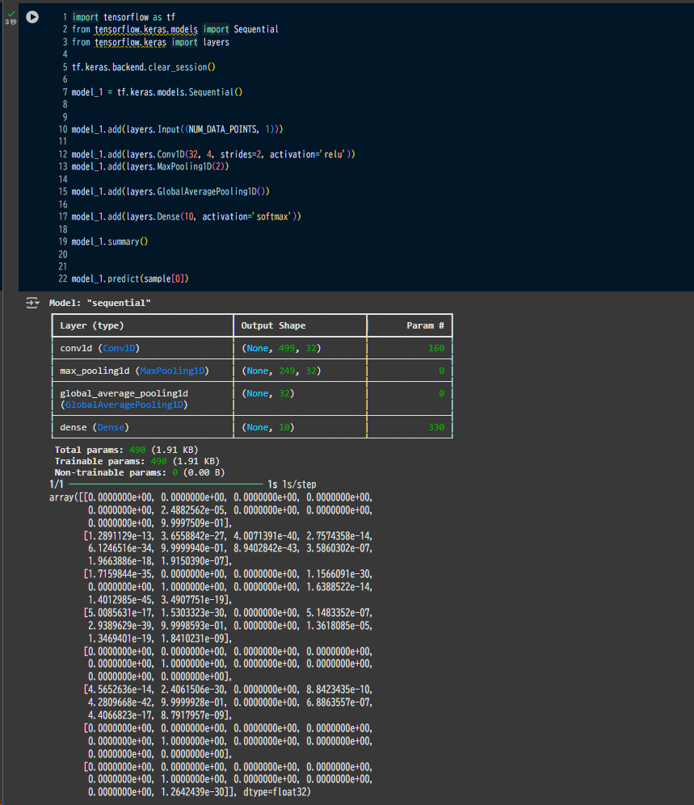

- 単純RNN (SimpleRNN)
単純なRNN(RNNレイヤーの次に直接全結合層を配置)
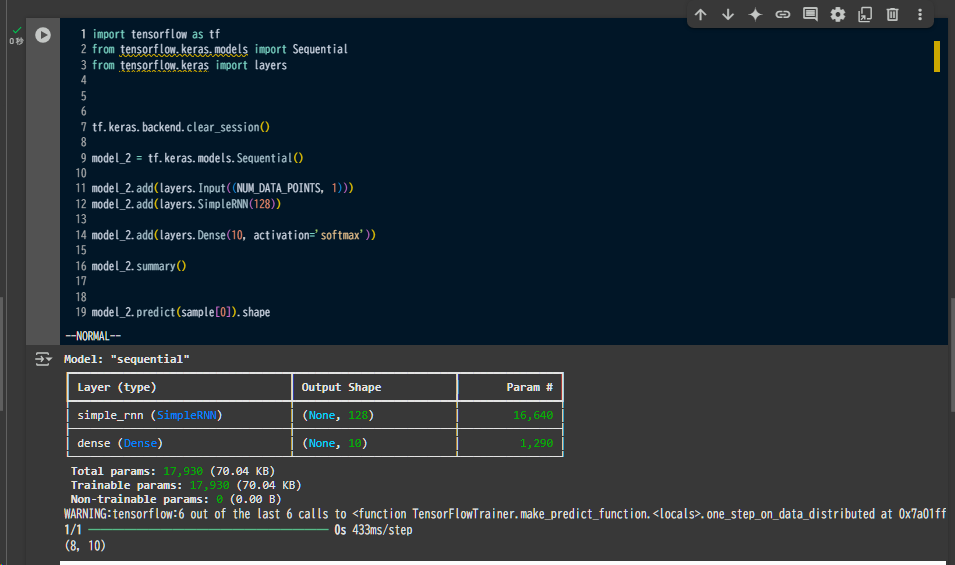

- GRU (Gated Recurrent Unit)
単純なRNNより早くなっている！
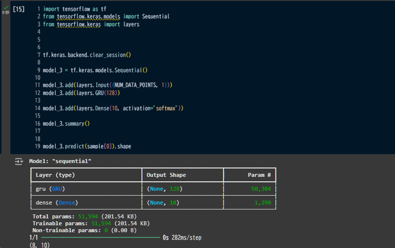

- 双方向 LSTM (Bidirectional LSTM)
Kerasで双方向に接続されたネットワークを定義するためには、系列データに対するレイヤーをBidirectionalを使用
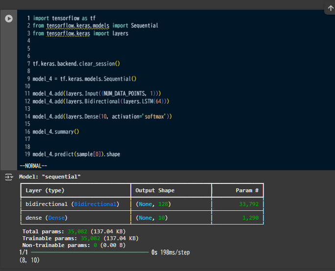

- 勾配クリッピングの実装
Kerasのモデルでクリッピング
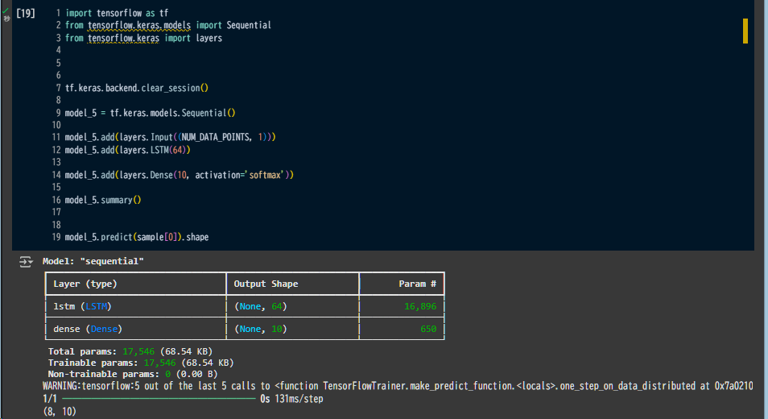


# 【フレームワーク演習】Seq2Seq
([目次に戻る](#目次))

- データ準備
sin関数の値からcos関数の値をSeq2Seqモデルに予測させることを試みる。
入力データとして、seq_inを、seq_outを出力データ(教師データ)として準備する。
sin関数の値が入力値、cos関数の値が推論したい値
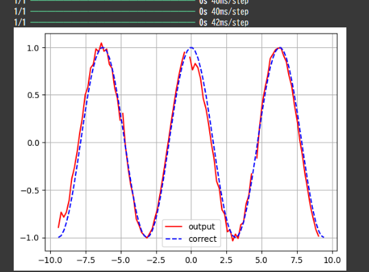

- モデルの学習
モデルを定義するパラメータ
*   NUM_ENC_TOKENS: 入力データの次元数
*   NUM_DEC_TOKENS: 出力データの次元数
*   NUM_HIDDEN_PARAMS: 単純RNN層の出力次元数(コンテキストの次元数にもなる)

*   NUM_STEPS: モデルへ入力するデータの時間的なステップ数。
```python
NUM_ENC_TOKENS = 1
NUM_DEC_TOKENS = 1
NUM_HIDDEN_PARAMS = 10
NUM_STEPS = 24
```

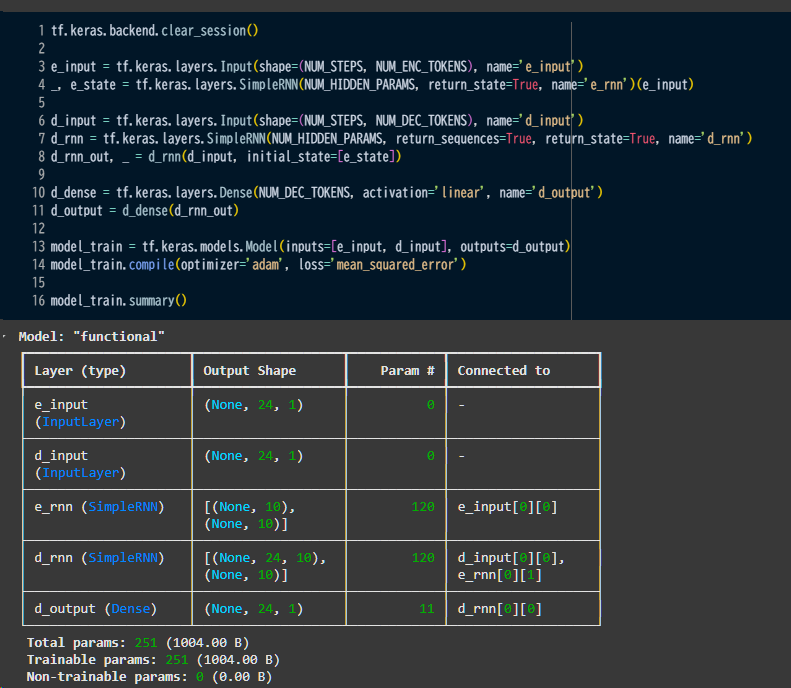
※エンコーダーの出力として、ステート(コンテキスト)のみをデコーダー側へ渡している!
エンコーダーとデコーダーはコンテキスト以外に繋がりのない分離したモデル構造

※データ
ex: エンコーダーの入力として使用する値。
dx: デコーダーの入力として渡す値。最終的に出力したい値の1つ前のステップの値。
dy: 最終的に推論したい値。dxと比べて時間的に1ステップ先の値となっている。

ミニバッチのサイズ: 16 エポック数: 80回

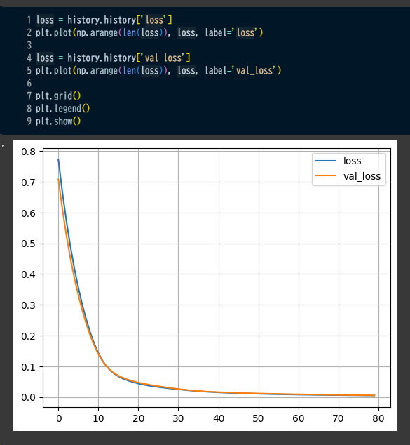

デコーダーにコンテキストの入力がある点に注意。
Seq2Seqの推論時には逐次、それまでに推論した結果を次の推論に用いる。
ステート(コンテキスト)は、このときモデルの外に保持しておき、デコーダーの入力として渡される。

- 推論用関数の定義
エンコーダーで初期のコンテキストを取得する
デコーダーで初期のコンテキストと1文字目を元に推論を開始する
デコーダーから最終出力とコンテキストが出力され、次のステップでのデコーダーのコンテキストとして使われる


# 【フレームワーク演習】data-augmentation
([目次に戻る](#目次))
- 下記元画像を加工し、学習用データの水増し


- Horizontal Flip(水平反転)
  - 画像を左右に反転させる処理
  - オブジェクトや特 徴が画像内で左右に対称的である場合
  - 文字や数字の認識モデルをトレーニングする際、文字や数字が左右対称であることが多いため、水平反転を適用することで、新しいトレーニングデータを生成可できます。

TensorFlow/Keras APIのtf.image.random_flip_left_right
<table>
  <tr>
    <td>変換後<br></td>
    <td>元<br></td>
  </tr>
</table>

- Vertical Flip（垂直反転）
  - 画像を上下に反転させる処理
  - オブジェクトや特徴が画像内で上下対称である場合に有効
  - 例：顔認識など、上下対称な特徴を持つ画像で新しいトレーニングデータを生成できる
  - モデルの学習データを多様化し、さまざまな視点や条件での頑健性向上に役立つ

TensorFlow/Keras API: `tf.image.random_flip_up_down`
<table>
  <tr>
    <td>変換後<br></td>
    <td>元<br></td>
  </tr>
</table>


- Crop（切り抜き）
  - 切り抜きは、物体検出やセグメンテーションなどで、画像内の特定領域や特徴に焦点を当てる際に有効
  - 切り抜く領域のサイズや位置を調整することで、データセットの多様化やモデルの汎化性能向上に役立つ
  - ランダムな切り抜きを行うことで、モデルの位置やサイズ変化への頑健性高める

TensorFlow/Keras API: `tf.image.random_crop`
<table>
  <tr>
    <td>変換後<br>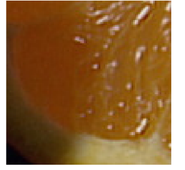</td>
    <td>元<br></td>
  </tr>
</table>
- Contrast（コントラスト調整）
  - コントラストの調整は、画像の明暗差を変化させることで、特徴の視認性を高めたり、環境の違いに対応した学習を促進できる
  - コントラストを高めると、明るい部分と暗い部分の差が強調され、特徴の識別がしやすくなる
  - ランダムなコントラスト変更により、モデルが照明条件の変化に対して頑健になる

TensorFlow/Keras API: tf.image.random_contrast
<table> <tr> <td>変換後<br></td> <td>元<br></td> </tr> </table>

- Brightness（明るさ調整）
  - 明るさの調整は、画像の輝度レベルを変化させることで、照明条件の違いをシミュレーションできる
  - 明るさを変化させることで、オブジェクトの視認性や環境光の影響を反映した学習データを作成できる
  - ランダムな明るさ変更により、モデルの明暗変化への適応力が高まる

TensorFlow/Keras API: tf.image.random_brightness

<table> <tr> <td>変換後<br></td> <td>元<br></td> </tr> </table>

- Rotate（回転）
  - 回転は、画像を90度単位で回転させることで、視点の変化に対するモデルの頑健性を高める
  - 水平方向・垂直方向・180度など、複数の回転方向を学習させることで、モデルが異なる角度の物体にも適切に反応できるようになる
  - データセットの多様化と汎化性能向上に効果的
TensorFlow/Keras API: tf.image.rot90

<table> <tr> <td>変換後<br></td> <td>元<br></td> </tr> </table>

- Gaussian Filter（ガウシアンフィルタ）
  - ガウシアンフィルタは、画像に対して平滑化（ぼかし）を施すことで、ノイズを抑えたり、視覚的に滑らかな画像を生成する
    - ガウス関数 $G(x, y) = \frac{1}{2\pi\sigma^2} e^{-\frac{x^2 + y^2}{2\sigma^2}}$ に基づくカーネルを用いて、画像に畳み込み処理を行う
    - ノイズ除去、スケール空間の構築、エッジの弱体化など、前処理や物体検出前段階で広く活用される
    - シグマ $\sigma$ やカーネルサイズの調整により、平滑化の強度を制御できる

<table> <tr> <td>変換後<br></td> <td>元<br></td> </tr> </table>

- RandAugment（ランダム拡張）
  - RandAugment は Google によって提案された、自動的かつ効率的にデータ拡張を適用する手法
  - 2つのハイパーパラメータ n（適用回数）と m（強度）によって動作が制御される
    - n: 画像に対して適用される拡張操作の数
    - m: 各拡張の強さ（スケール）
  - 拡張操作は、回転・色相変化・切り抜き・シアー・反転 など、複数の手法からランダムに選ばれ適用される
  - モデルの汎化性能を高めると同時に、拡張戦略の設計コストを削減できる
  - 同様の自動拡張手法として AutoAugment や TrivialAugment も存在する

論文: RandAugment: Practical automated data augmentation
Keras公式実装: https://keras.io/examples/vision/randaugment/

TensorFlow/Keras API（例）:
```python
from keras_cv.layers import RandAugment
data_augmentation = RandAugment(value_range=(0, 255), augmentations_per_image=n, magnitude=m)
augmented = data_augmentation(image)
```

- Random Erasing（ランダム消去）
  - Random Erasing は、画像の一部領域をランダムに矩形マスク（隠す）することで、部分的欠損に対するモデルの頑健性を高めるデータ拡張手法
  - 一見単純な処理ながら、画像認識や分類精度の向上に大きく貢献する
  - 欠損データに近い状況を模倣できるため、ロバスト性向上や過学習抑制にも効果的
  - 主なハイパーパラメータ
    - p : Random Erasing を適用する確率
    - s1, s2 : マスク領域の面積比（画像全体に対する最小・最大比率）
    - r1, r2 : マスク領域のアスペクト比（縦横比）の最小・最大範囲
```python
import torchvision.transforms as transforms

transform = transforms.Compose([
    transforms.ToTensor(),
    transforms.RandomErasing(p=0.5, scale=(0.02, 0.33), ratio=(0.3, 3.3))
])
```
<table> <tr> <td>変換後<br></td> <td>元<br></td> </tr> </table>

- MixUp
  - 水増し手法: 2つの学習データを混合（ラベル/データ双方を線形補完）させる
  -参考資料: "mixup: Beyond Empirical Risk Minimization"
  -出典: https://arxiv.org/pdf/1710.09412v1.pdfmixup.png
  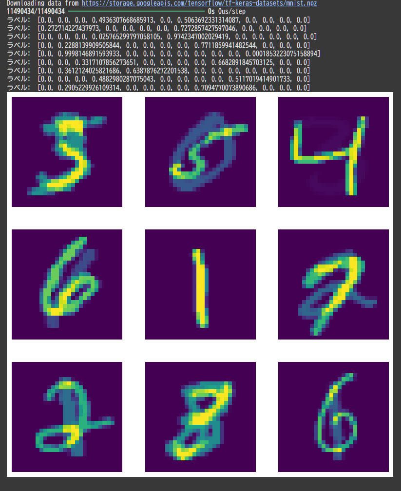

- EDA（Easy Data Augmentation for Text）
  - EDA は、自然言語処理におけるシンプルかつ効果的なデータ拡張手法として、2019年のEMNLP で提案された技術
  - テキストデータは、単語の順番や意味の変化に敏感なため、画像よりも拡張が難しいが、EDAはその課題に対して軽量で実用的なアプローチを提供
  - 特に少量データのテキスト分類タスクで、精度向上や過学習の抑制に有効
  - 論文: Easy Data Augmentation Techniques for Boosting Performance on Text Classification Tasks

- Synonym Replacement（SR：類義語の交替）
  - Stop words 以外の単語からランダムに n 個選び、各単語を WordNet などの辞書から取得した類義語で置き換える
  - 例:「彼は速く走る」→「彼は迅速に走る」
- Random Insertion（RI：ランダム挿入）
  - Stop words 以外の単語の類義語を取得し、文章中のランダムな位置に n 回挿入する
  - 例:「彼は走る」→「彼は素早く走る」
- Random Swap（RS：ランダム交換）
  - 文中の2つの単語をランダムに選び、位置を入れ替える操作を n 回繰り返す
  - 例:「彼は速く走る」→「速くは彼走る」
- Random Deletion（RD：ランダム削除）
  - 各単語に対して確率 p で削除を試み、短縮・省略を模倣
  - 例:「彼は速く走る」→「彼は走る」

- 特徴と利点：
  - 実装が簡単で、データが少ない環境でも導入しやすい
  - 事前学習モデルを使わなくても精度向上が可能
  - 他の手法（BERT, GPT, LSTMなど）との併用も可能
  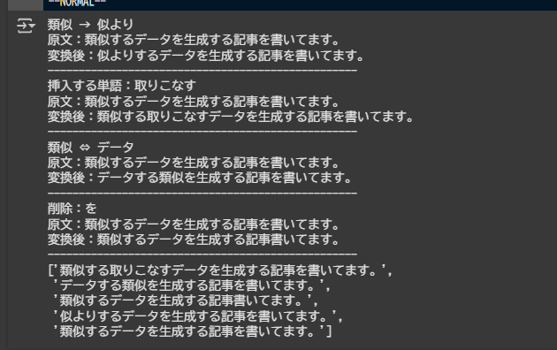

# 【フレームワーク演習】activate_functions
([目次に戻る](#目次))

- 活性化関数について
ニューラルネットワークの順伝播（forward）では、線形変換で得た値に対して、非線形な変換を行う。非線形な変換を行う際に用いられる関数を、活性化関数という。

$z = f(u)$
$y = g(z)$
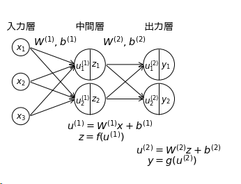

$f$:「中間層に用いる活性化関数」
$g$:「出力層に用いる活性化関数」

ニューラルネットワークの学習（パラメータの探索）では、逆伝播（backward）アルゴリズムとして、微分法における連鎖律を利用した誤差逆伝播法が用いられる。
 → 微分可能、かつ渡された値から直接的に微分値を求める導関数が利用できるという要件を満たした活性化関数が用いられる
関数$f$の導関数は、$\frac{\partial}{\partial x} f$または$f'$と表す。

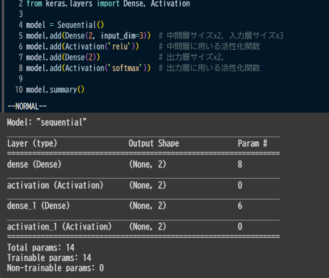

## 中間層に用いる活性化関数

- シグモイド関数
別名: 標準シグモイド関数、ロジスティック・シグモイド関数

省略表記として、$\sigma$がよく用いられる

誤差逆伝播法の黎明期によく用いられた

導関数の最大値が0.25であり、入力値が0から遠ざかるほど0に近い微分値を取るため、中間層を深く重ねるほど勾配消失が発生しやすくなる（勾配消失問題）

入力値を$x$として当該関数（順伝播）とその導関数（逆伝播）を数式表現すると、次のようになる。

順伝播: $\sigma(x) = \frac{1}{1 + e^{-x}}$
逆伝播: $\sigma'(x) = \sigma(x) (1 - \sigma(x))$
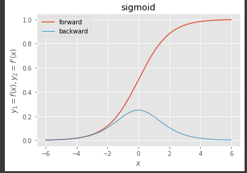

- tanh
別名: 双曲線正接関数

シグモイド関数の代替とみなされていた

導関数の最大値が1であり、シグモイド関数の0.25以上だが、それでも入力値が0から遠ざかるほど0に近い微分値を取るため、中間層を深く重ねるほど勾配消失が発生しやすくなる

入力値を$x$として当該関数（順伝播）とその導関数（逆伝播）を数式表現すると、次のようになる。

順伝播: $\tanh(x) = \frac{e^x - e^{-x}}{e^x + e^{-x}}$
逆伝播: $\tanh'(x) = 1 - \tanh^2(x) = \frac{1}{\cosh^2(x)}$

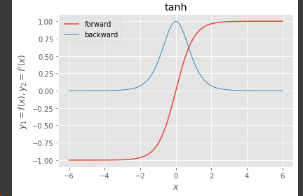

- ReLU
  - 別名: 正規化線形関数、ランプ関数
  - 入力値が0以上のときは入力値と同じ値、それ以外のときは0
  - 導関数はヘヴィサイドの階段関数
  - 原点において不連続（微分不可能な点が存在する）
  - 導関数の実装では、入力値0の微分値を定義した劣微分が用いられる
  - 導関数における入力値が正のときの微分値が常に1なので、勾配消失が発生しにくい
  - 導関数における入力値が負のとき、学習が進まない
  - 入力値を$x$として当該関数（順伝播）とその導関数（逆伝播）を数式表現すると、次のようになる。
    - 順伝播: $\text{ReLU}(x) = \max(0, x)$
    - 逆伝播: $\text{ReLU}'(x) = \begin{cases} 1 & (x > 0) \ 0 & (x &lt; 0) \ \text{undefined} & (x = 0) \end{cases}$

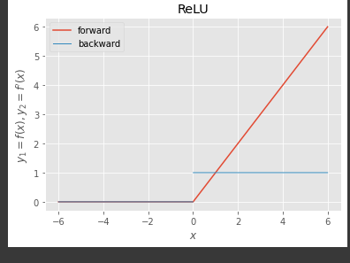

- Leaky ReLU
  - 別名: 漏洩正規化線形関数
  - 入力値が0以上のときは入力値と同じ値、それ以外のときは入力値に定数$\alpha$を乗算したもの
  - $\alpha$の値は基本的には0.01とする
  - 原点において不連続（微分不可能な点が存在する）（ReLUと同じ）
  - 導関数の実装では、入力値0の微分値を定義した劣微分が用いられる（ReLUと同じ）
  - 導関数における入力値が正のときの微分値が常に1なので、勾配消失が発生しにくい（ReLUと同じ）
  - 導関数における入力値が負のときは、小さな傾きの1次関数となる
  - 入力値を$x$として当該関数（順伝播）とその導関数（逆伝播）を数式表現すると、次のようになる。
    - 順伝播: $\text{Leaky ReLU}(x) = \begin{cases} x & (x > 0) \ \alpha x & (x \le 0) \end{cases}$
    - 逆伝播: $\text{Leaky ReLU}'(x) = \begin{cases} 1 & (x > 0) \ \alpha & (x &lt; 0) \ \text{undefined} & (x = 0) \end{cases}$

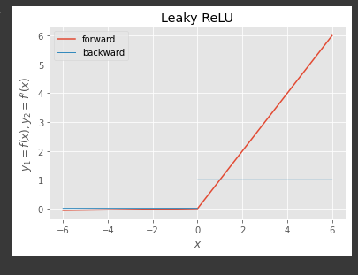

- Swish
  - ReLUの代替候補として注目
  - 別名: シグモイド加重線形関数（SiLU）
  - ReLUやLeaky ReLUとは異なり、原点において連続（微分不可能な点が存在しない）
  - $\beta$の値は基本的に1とする
  - $\beta$はパラメータでもハイパーパラメータでも可
  - 関連論文: "Sigmoid-Weighted Linear Units for Neural Network Function Approximation in Reinforcement Learning"
  - 関連論文: "Searching for Activation Functions"
  - 入力値を$x$として当該関数（順伝播）とその導関数（逆伝播）を数式表現すると、次のようになる。
  - 順伝播: $\text{Swish}(x) = x \cdot \sigma(\beta x)$
  - 逆伝播: $\text{Swish}'(x) = \sigma(\beta x) + x \cdot \sigma(\beta x) (1 - \sigma(\beta x)) \cdot \beta$

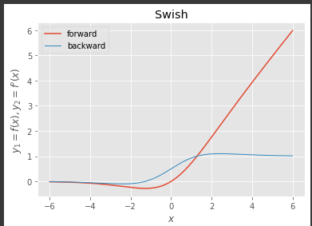

## 出力層に用いる活性化関数
- 2値分類: シグモイド関数
  - 出力層のサイズ（ユニット数）は1
  - クラス番号1を正例または陽性（Positive）、クラス番号0を負例または陰性（Negative）と呼ぶ
  - シグモイド関数の出力値を、正例である確信度（Positive confidence）と呼ぶ
  - 正例である確信度の取り得る値は、0から1迄の範囲内
  - 負例である確信度（Negative confidence）は、1に対して正例である確信度を減算して求める
  - 分類するために、閾値を設定する
  - 閾値は基本的には0.5
  - 正例である確信度が閾値を上回るときは正例（クラス番号1）、それ以外は負例（クラス番号0）に分類する
  - シグモイド関数の数式、コード、及びグラフは、前述の「中間層における活性化関数」の「シグモイド関数」を参照。

- 多値分類: ソフトマックス関数
- 出力層のサイズ（ユニット数）はクラス数と同じ
- シグモイド関数を多値分類用に拡張したもの
- 出力値の総和が1

$$g(\mathbf{x})_i = \frac{e^{x_i}}{\sum_{k=1}^{n} e^{x_k}} \quad \{i \in \mathbb{N} \mid 1 \le i \le n\}$$
$$
\frac{\partial}{\partial x_j} g(\mathbf{x})_i =
\begin{cases}
g(\mathbf{x})_i (1 - g(\mathbf{x})_i) & (i = j) \\
-g(\mathbf{x})_i g(\mathbf{x})_j & (i \neq j)
\end{cases}
$$
$$= g(\mathbf{x})_i (\delta_{ij} - g(\mathbf{x})_j)$$

- 回帰: 恒等関数 (活性化関数なし)
  * 出力層のサイズ（ユニット数）は1
  * 別名：恒等写像、線形関数
  * 出力値は入力値と同じ


$$g(x) = x$$

$$\frac{\partial}{\partial x} g(x) = 1$$
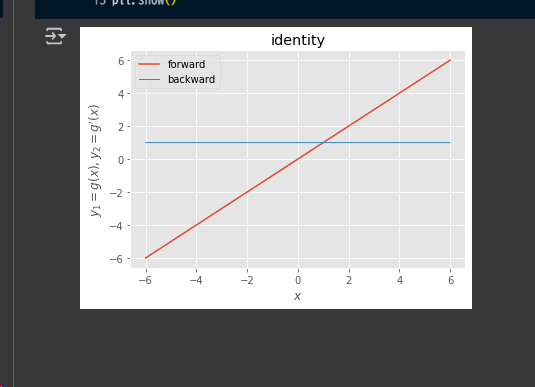


## 参考文献からの補足
『ゼロから作るDeep Learning』からの補足
- 非線形変換: シグモイド関数は入力信号を0から1の間の実数値に変換する非線形関数です。ニューラルネットワークにおいて活性化関数が非線形であることは、ネットワークがより複雑な表現を獲得するために非常に重要です。もし活性化関数が線形であれば、ネットワーク全体としても線形な変換しか行えず、層を深くすることのメリットがなくなってしまいます。
- 確率的な解釈: シグモイド関数の出力は0から1の間の値を取るため、確率として解釈できる場合があります。特に、二値分類問題の出力層で用いられることが多く、出力値を「あるクラスに属する確率」と見なすことができます。
- 微分可能性: シグモイド関数は微分可能であり、その微分は容易に計算できます。これは、ニューラルネットワークの学習に用いられる誤差逆伝播法において重要な性質です。シグモイド関数の微分は、y(1−y)で表されます（ここで、yはシグモイド関数の出力）。
- S字カーブ: シグモイド関数のグラフはS字カーブを描きます。この形状が、入力値が小さいときには出力を0に近づけ、大きいときには出力を1に近づけるという、オン・オフのような切り替えの特性を与えます。